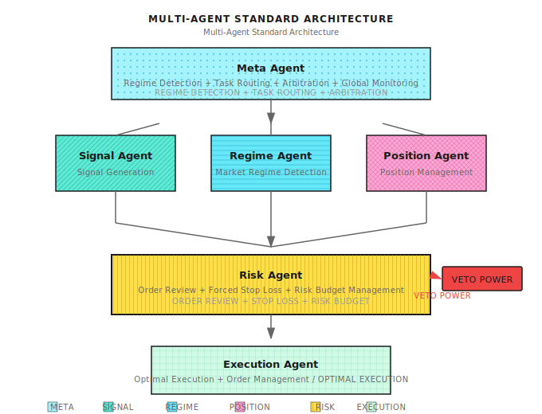

# Lesson 11: Why Multi-Agent

> **A person cannot simultaneously be a surgeon, lawyer, and pilot. Trading systems are the same - specialization enables excellence.**

---

## The All-in-One Dilemma

In 2018, a quant team developed an "all-in-one Agent":

- Could identify market regimes
- Could generate trading signals
- Could manage risk
- Could execute orders
- Could monitor anomalies

**Backtest results were stunning**: 45% annualized return, 2.3 Sharpe ratio, 12% max drawdown.

They confidently deployed it live.

**Three months later, the postmortem**:

| Issue | What Happened | Root Cause |
|-------|---------------|------------|
| Signal delay | When market moved, Agent was still calculating risk | Serial processing, cannot parallelize |
| Risk control failure | Stop-loss skipped during extreme markets | One module failure blocks everything |
| Hard to debug | Lost money, don't know where the problem is | Responsibilities mixed, cannot isolate |
| Hard to improve | Want to optimize execution, worried about affecting signals | Tight coupling, everything interconnected |

**Core problem**: Their Agent was a "super brain" doing everything, resulting in nothing done well.

It's like having one surgeon act as anesthesiologist, nurse, and hospital director simultaneously - theoretically possible, but practically guaranteed to fail.

---

## 11.1 Structural Defects of Single Agent

### Why Isn't One Agent Enough?

| Defect | Explanation | Impact |
|--------|-------------|--------|
| **Cannot parallelize** | One Agent can only process tasks sequentially | Miss time-sensitive opportunities |
| **Single point of failure** | One module crashes, entire system stops | Risk out of control |
| **Cannot specialize** | Does everything, excels at nothing | Mediocre overall performance |
| **Hard to debug** | Where's the problem? Signal? Risk? Execution? | Inefficient postmortem |
| **Limited scalability** | Adding features requires changing entire system | Slow iteration |

### Visual Comparison


---

## 11.2 Core Advantages of Multi-Agent

### Advantage 1: Specialization

Each Agent does one thing, but does it excellently:

| Agent | Specialization | Evaluation Metrics |
|-------|----------------|-------------------|
| **Signal Agent** | Predict future returns | IC, IR, Directional accuracy |
| **Risk Agent** | Protect capital | Max drawdown, VaR |
| **Execution Agent** | Optimal execution price | Slippage, Fill rate |
| **Regime Agent** | Identify market state | Switching accuracy, Latency |

**Analogy**: A trading system is like a hospital - needs specialists, not one all-purpose doctor.

### Advantage 2: Parallel Processing

```
Scenario: Market suddenly moves, need to do multiple things simultaneously

Single Agent:
  09:30:00 Receive quote
  09:30:01 Calculate signal
  09:30:02 Calculate risk
  09:30:03 Prepare order
  09:30:04 Submit order  <- 4 second delay, may miss opportunity

Multi-Agent:
  09:30:00 Quote broadcast
           |-- Signal Agent: Calculate signal
           |-- Risk Agent: Assess risk
           +-- Execution Agent: Prepare execution environment
  09:30:01 Signal ready -> Risk Agent instant approval
  09:30:01.5 Order submitted  <- 1.5 seconds, 2.5x faster
```

### Advantage 3: Fault Isolation

```
Scenario: Execution Agent has a bug

Single Agent:
  Entire system crashes
  -> Cannot stop-loss
  -> Cannot monitor
  -> Catastrophic outcome

Multi-Agent:
  Execution Agent fails
  -> Risk Agent detects execution anomaly
  -> Triggers emergency circuit breaker
  -> Notifies human intervention
  -> Other Agents continue running
  -> Loss controlled
```

### Advantage 4: Independent Iteration

```
Scenario: Want to optimize execution algorithm

Single Agent:
  Modify execution code
  -> Worried about affecting signal logic
  -> Need full regression testing
  -> 2 week iteration cycle

Multi-Agent:
  Only modify Execution Agent
  -> Interface unchanged, other Agents unaffected
  -> Test execution logic independently
  -> 2 day iteration cycle
```

---

## 11.3 Multi-Agent Collaboration Mechanisms

### Communication Patterns

| Pattern | Use Case | Example |
|---------|----------|---------|
| **Request-Response** | Operations requiring confirmation | Signal -> Risk: "Can I buy AAPL?" |
| **Publish-Subscribe** | Broadcast notifications | Data Agent publishes new quotes, all subscribers receive |
| **Queue** | Asynchronous processing | Order queue, Execution Agent processes one by one |
| **Shared State** | Need consistent view | All Agents share position state |

### Decision Arbitration

When multiple Agents have conflicting opinions, how to decide?

**Approach 1: Hierarchical Structure**


**Approach 2: Voting Mechanism**

```
Signal Agent: Buy AAPL (+1 vote)
Risk Agent: Don't buy, concentration limit exceeded (-1 vote)
Regime Agent: Currently trending market, inclined to follow signal (+1 vote)

Vote result: +1, execute buy (possibly reduce position to satisfy risk)
```

**Approach 3: Veto Power**

```
Risk Agent has veto power:
  Any trade must be approved by Risk Agent
  If Risk Agent says "no", trade doesn't execute
  This is the last line of defense for protecting capital
```

### Responsibility Boundaries

| Agent | Responsible For | Not Responsible For |
|-------|----------------|---------------------|
| **Signal Agent** | Generate signals, predict returns | Risk, Execution |
| **Risk Agent** | Review orders, force stop-loss | Signal quality |
| **Execution Agent** | Optimal execution, order management | Signals, Risk |
| **Regime Agent** | Identify market state | Trading decisions |
| **Meta Agent** | Coordinate, arbitrate, global decisions | Specific execution |

**Golden Rule**: Each Agent only cares about its own responsibilities, trusting other Agents to do their jobs.

---

## 11.4 Multi-Agent Architecture Design

### Standard Architecture



### Detailed Agent Responsibilities

| Agent | Input | Output | Key Metrics |
|-------|-------|--------|-------------|
| **Data Agent** | External data sources | Cleaned data | Latency, Completeness |
| **Signal Agent** | Features | Predicted returns/rankings | IC, IR |
| **Regime Agent** | Price, Volatility | Current market state | Accuracy, Switching latency |
| **Position Agent** | Current positions | Target positions | Turnover, Cost |
| **Risk Agent** | Pending orders | Approve/Reject/Adjust | Prevented losses |
| **Execution Agent** | Approved orders | Execution report | Slippage, Fill rate |
| **Meta Agent** | Global state | Scheduling commands | System health |

---

## 11.5 When Multi-Agent Fails

### When Is Multi-Agent Actually Worse?

| Scenario | Reason | Better Choice |
|----------|--------|---------------|
| **Ultra-simple strategy** | Just a few rules, no need for division | Single script |
| **Low latency requirements** | Agent communication has overhead, may add 1-10ms | Single process optimization |
| **Team too small** | 1 person cannot maintain multiple Agents | Validate with single Agent first |
| **Coordination cost > benefit** | Too many Agents, communication complexity explodes | Reduce Agent count |

### Common Multi-Agent Problems

| Problem | Symptom | Solution |
|---------|---------|----------|
| **Deadlock** | Agents waiting for each other | Timeout mechanism + Priority |
| **Message loss** | Critical signals not delivered | Acknowledgment + Retry |
| **State inconsistency** | Different Agents see different positions | Shared state + Sync mechanism |
| **Cascade failure** | One failure triggers chain reaction | Circuit breaker + Graceful degradation |

---

## 11.6 Progressive Evolution Path

### From Single Agent to Multi-Agent

Don't build complex systems from the start. Recommended path:

```
Stage 1: Single Agent
  |-- Validate strategy viability
  |-- Fast iteration
  +-- Accumulate experience

Stage 2: Signal + Risk Separation
  |-- Signal Agent
  +-- Risk Agent (veto power)

Stage 3: Add Execution
  |-- Signal Agent
  |-- Risk Agent
  +-- Execution Agent

Stage 4: Add Regime
  |-- Regime Agent
  |-- Signal Agent (adjust based on Regime)
  |-- Risk Agent
  +-- Execution Agent

Stage 5: Complete Architecture
  |-- Meta Agent
  |-- Data Agent
  |-- Regime Agent
  |-- Signal Agent
  |-- Position Agent
  |-- Risk Agent
  +-- Execution Agent
```

### Acceptance Criteria for Each Stage

| Stage | Acceptance Criteria |
|-------|---------------------|
| 1 -> 2 | Strategy Sharpe > 1, need stricter risk control |
| 2 -> 3 | Slippage cost > 10% of returns, need execution optimization |
| 3 -> 4 | Large performance difference across market states, need Regime detection |
| 4 -> 5 | System complexity requires unified orchestration |

---

## 11.7 Multi-Agent Perspective

### This Lesson's Position

```
Parts 1-3: Building individual Agent capabilities
  |-- Understanding markets
  |-- Mastering math and statistics
  |-- Learning machine learning
  +-- From models to Agents

Part 4 (starting from this lesson): Building multi-Agent systems
  |-- Lesson 11: Why Multi-Agent <- You are here
  |-- Lesson 12: Regime Detection (Regime Agent)
  |-- Lesson 13: Regime Misjudgment and Systemic Collapse
  |-- Lesson 14: LLM Applications in Quant
  |-- Lesson 15: Risk Control and Money Management (Risk Agent)
  |-- Lesson 16: Portfolio Construction and Exposure Management
  +-- Lesson 17: Online Learning and Strategy Evolution
```

### Upcoming Lessons Preview

| Lesson | Focus Agent | Core Capability |
|--------|-------------|-----------------|
| Lesson 12 | Regime Agent | Identify bull/bear/ranging markets |
| Lesson 13 | Resilience Layer | Misjudgment diagnosis, degradation strategy |
| Lesson 14 | Research Agent (LLM) | Information extraction, analytical assistance |
| Lesson 15 | Risk Agent | Veto power, money management |
| Lesson 16 | Portfolio Agent | Position allocation, exposure monitoring |
| Lesson 17 | Evolution Agent | Online learning, strategy evolution |

---

## Lesson Deliverables

After completing this lesson, you will have:

1. **Deep understanding of multi-agent architecture** - Know why division of labor and collaboration is needed
2. **Architecture design capability** - Can draw standard multi-Agent system architecture
3. **Collaboration mechanism design** - Understand communication, arbitration, responsibility boundaries
4. **Progressive evolution strategy** - Know when to upgrade from single Agent to multi-Agent

### Acceptance Criteria

| Checkpoint | Acceptance Standard | Self-Test Method |
|------------|---------------------|------------------|
| **Single Agent defects** | Can list 5 structural problems | List without notes |
| **Architecture diagram** | Can draw standard multi-Agent architecture | Draw on blank paper, annotate Agent responsibilities |
| **Collaboration mechanisms** | Can explain 3 decision arbitration methods | Given conflict scenario, state solution |
| **Evolution path** | Can describe 5 stages from single to multi | Describe without notes |

**Design Exercise**:

You have a running single Agent strategy with the following performance:
- 25% annualized return
- 18% max drawdown
- Significant losses in ranging markets
- Execution slippage about 15% of returns

Question: How should you evolve the architecture? Which Agent to split first?

<details>
<summary>Click to see answer</summary>

**Analysis**:
1. Ranging market losses -> Need Regime Agent to identify market state
2. 15% slippage -> Need Execution Agent to optimize execution
3. 18% drawdown is high -> Risk Agent needs stronger controls

**Recommended evolution order**:
1. **First**: Split Risk Agent (18% drawdown too high, risk control priority)
2. **Second**: Add Regime Agent (solve ranging market loss problem)
3. **Finally**: Split Execution Agent (optimize 15% slippage)

**Rationale**: Protect capital first, then improve returns.

</details>

---

## Lesson Summary

- [x] Understand 5 structural defects of single Agent
- [x] Master 4 core advantages of multi-Agent: specialization, parallel processing, fault isolation, independent iteration
- [x] Learn 3 decision arbitration mechanisms: hierarchical structure, voting, veto power
- [x] Recognize multi-Agent failure scenarios: ultra-simple strategy, low latency, small team
- [x] Master progressive evolution path from single Agent to multi-Agent

---

## Further Reading

- [Background: Multi-Agent Framework Comparison](Background/Multi-Agent-Framework-Comparison.md) - Technical selection of mainstream frameworks
- [Background: Quant Open Source Framework Comparison](Background/Quant-Framework-Comparison.md) - Tech stack for quant systems

---

## Next Lesson Preview

**Lesson 12: Regime Detection**

Use trend-following in trending markets, mean reversion in ranging markets - everyone knows this principle. But the question is: **How do you identify what market you're in?** Next lesson we dive deep into the Regime Agent's core capability.
