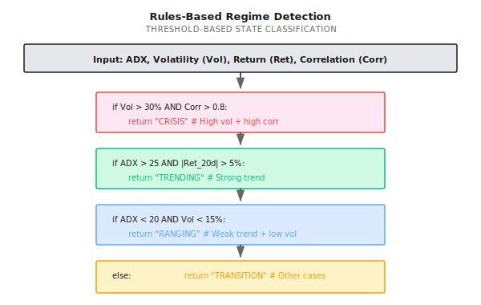
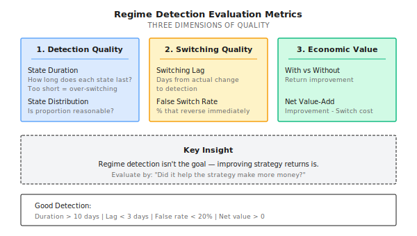
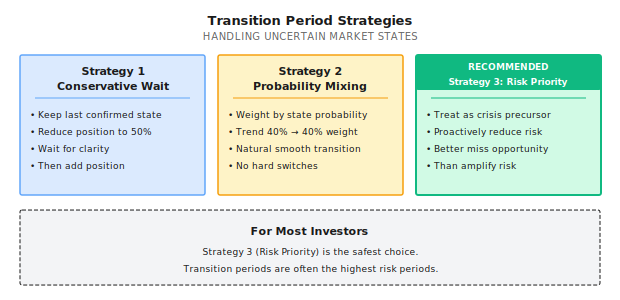
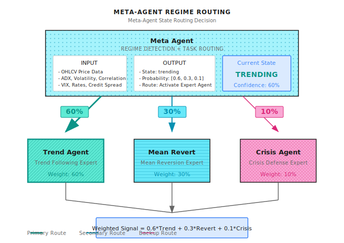

# Lesson 12: Regime Detection

> **Goal**: Enable the system to know "what market we're in now" so it can choose the right strategy.

---

## A Typical Scenario (Illustrative)

> Note: The following is a synthetic example to illustrate common phenomena; numbers are illustrative and don't correspond to any specific institution/product.

In early 2021, a quant fund simultaneously ran two strategies: trend following and mean reversion. Both strategies performed excellently in their respective favorable markets.

The problem was they used **fixed weights** - 50% each.

Result:
- In trending markets, trend strategy gained 20%, mean reversion lost 15%, net gain 2.5%
- In ranging markets, mean reversion gained 15%, trend strategy lost 20%, net loss 2.5%
- For the whole year, the two canceled each other out, returns close to zero

Their competitor? Same two strategies, but added a **Regime Detection module**:
- In trending markets, trend strategy weight 80%, mean reversion 20%
- In ranging markets, reversed

Result: 18% annual return, Sharpe ratio 1.6.

**What's the difference?** Not the strategies themselves, but **knowing when to use which strategy**. This is the value of regime detection - it's the "router" of the multi-agent system.

---

## 12.1 What Is Market Regime

### Three Basic States

The market is always in some "state" at any moment. While boundaries between states aren't clear, they can be roughly categorized:

| State | Characteristics | Best Strategy | Typical Duration |
|-------|-----------------|---------------|------------------|
| **Trending** | Price moves persistently in one direction, volatility rises | Momentum/Trend following | Weeks to months |
| **Mean-Reverting** | Price oscillates within a range, mean reversion works | Mean reversion/Grid | Weeks to months |
| **Crisis** | Violent swings, correlations spike, liquidity dries up | Risk control priority/Cash is king | Days to weeks |

### Why Is Regime Detection So Hard?

| Challenge | Explanation |
|-----------|-------------|
| **Rearview mirror problem** | States are clear in hindsight, fuzzy in real-time |
| **Fuzzy boundaries** | No clear dividing line between trend and ranging |
| **Nested states** | Daily ranging, weekly trending, monthly ranging can coexist |
| **Detection lag** | By the time you confirm the state, it may be nearly over |
| **Switching costs** | Frequent strategy switching is itself a cost |

### Paper Exercise: Identify Historical States

Look at this data and judge each period's market state:

| Period | 20-Day Return | 20-Day Volatility | ADX | Your Judgment |
|--------|---------------|-------------------|-----|---------------|
| A | +12% | 18% | 35 | ? |
| B | -2% | 8% | 15 | ? |
| C | -25% | 45% | 28 | ? |
| D | +3% | 12% | 22 | ? |

<details>
<summary>Click to expand answer</summary>

| Period | Judgment | Reasoning |
|--------|----------|-----------|
| A | **Trending (up)** | High return + moderate volatility + high ADX (>25 indicates strong trend) |
| B | **Ranging** | Low return + low volatility + low ADX (<20 indicates no trend) |
| C | **Crisis** | Large decline + extremely high volatility (>30% annualized is warning level) |
| D | **Weak trend/Transition** | Return and ADX both in middle zone, hard to judge |

**Key finding**: Period D is hardest to judge - this is the most common real-world situation - most of the time the market is in "gray zones."

</details>

---

## 12.2 Four Methods for Regime Detection

### Method Comparison

| Method | Principle | Pros | Cons | Use Case |
|--------|-----------|------|------|----------|
| **Rules-based** | Use indicator thresholds | Simple, interpretable, no lag | Hard to choose thresholds, hard boundaries | Quick prototype, baseline |
| **Statistical** | Use statistical tests to identify structural changes | Mathematically rigorous | Needs historical data, has lag | Offline analysis |
| **Machine Learning** | Use ML models to classify | Can capture complex patterns | Needs labels, overfitting risk | When sufficient labeled data exists |
| **Hidden Markov** | Assume states follow Markov chain | Can estimate state probabilities | Assumptions may not hold | When number of states is known |

### Method 1: Rules-Based (Most Practical)

Use combinations of technical indicator thresholds to judge state:



**Paper Exercise: Design Your Rules**

Given the following market data, use the rules above to judge state:

| Scenario | ADX | 20-Day Volatility | 20-Day Return | Asset Correlation | State |
|----------|-----|-------------------|---------------|-------------------|-------|
| 1 | 32 | 22% | +8% | 0.4 | ? |
| 2 | 18 | 12% | -1% | 0.3 | ? |
| 3 | 25 | 38% | -15% | 0.85 | ? |
| 4 | 23 | 18% | +3% | 0.5 | ? |

<details>
<summary>Click to expand answer</summary>

| Scenario | State | Decision Path |
|----------|-------|---------------|
| 1 | **Trending** | Vol=22% < 30% (not crisis) -> ADX=32 > 25 and Ret=8% > 5% (trending) |
| 2 | **Ranging** | Vol=12% < 30% (not crisis) -> ADX=18 < 20 and Vol=12% < 15% (ranging) |
| 3 | **Crisis** | Vol=38% > 30% and Corr=0.85 > 0.8 (crisis takes priority) |
| 4 | **Transition** | Doesn't satisfy any clear condition (ADX=23 is between 20-25) |

</details>

### Method 2: Hidden Markov Model (HMM)

HMM assumes the market switches between several hidden states - we can only observe prices, not the true state.


**HMM Core Outputs**:
- **State probabilities**: Probability of being in each state now (e.g., Trending 60%, Ranging 30%, Crisis 10%)
- **Transition probabilities**: Probability of switching from one state to another

**Paper Exercise: Understanding State Probabilities**

HMM outputs current state probabilities as: Trending 55%, Ranging 35%, Crisis 10%

| Strategy Weight Approach | Trend Strategy | Mean Reversion | Defense Strategy | Issue |
|--------------------------|----------------|----------------|------------------|-------|
| Hard switch | 100% | 0% | 0% | Ignores 35% ranging probability |
| Probability weighted | 55% | 35% | 10% | More robust, but slow crisis response |
| Adjusted weighting | 50% | 30% | 20% | Amplify crisis weight as insurance |

**Key insight**: State probabilities shouldn't be used directly as strategy weights - they need adjustment based on risk preference.

<details>
<summary>Code Implementation (For Engineers)</summary>

```python
# Note: This is illustrative code showing basic HMM usage
# Requires hmmlearn: pip install hmmlearn

import numpy as np
from hmmlearn import hmm

class RegimeDetector:
    """HMM-based market regime detector"""

    def __init__(self, n_states: int = 3):
        self.n_states = n_states
        self.model = hmm.GaussianHMM(
            n_components=n_states,
            covariance_type="full",
            n_iter=100
        )

    def fit(self, features: np.ndarray):
        """
        Train HMM model

        features: shape (n_samples, n_features)
                  typically includes: returns, volatility, ADX, etc.
        """
        self.model.fit(features)
        return self

    def predict_proba(self, features: np.ndarray) -> np.ndarray:
        """
        Predict current state probability

        Returns: shape (n_states,) probability distribution
        """
        # Get posterior probabilities
        posteriors = self.model.predict_proba(features)
        return posteriors[-1]  # Latest time point probability

    def get_regime(self, features: np.ndarray, threshold: float = 0.5) -> str:
        """
        Get current state (with confidence threshold)
        """
        probs = self.predict_proba(features)
        max_prob = np.max(probs)
        max_state = np.argmax(probs)

        if max_prob < threshold:
            return "uncertain"

        state_names = ["trending", "mean_reverting", "crisis"]
        return state_names[max_state]
```

</details>

### Method 3: Volatility Clustering (Practical Variant)

A simplified but practical approach is to only look at volatility state:

| Volatility Range | State | Strategy Recommendation |
|------------------|-------|------------------------|
| < 15% | Low volatility (Ranging) | Mean reversion, Sell options |
| 15% - 25% | Normal volatility | Normal operation |
| 25% - 35% | High volatility (Trending) | Trend following, Reduce positions |
| > 35% | Extreme volatility (Crisis) | Risk control priority, Major position reduction |

**Why Is Volatility So Important?**
- Volatility is the market's "temperature," quickly reflects market health
- Volatility has clustering effect (high volatility tends to follow high volatility)
- Volatility is more predictable than returns

---

## 12.3 Evaluating Regime Detection

Regime detection isn't the goal - the goal is **improving strategy returns**. So the evaluation standard isn't "accuracy" but "did it help the strategy make more money."

### Evaluation Framework



### Paper Exercise: Calculate Regime Detection Value

**Scenario**: Your Regime Detection module's past year performance:

| Metric | Value |
|--------|-------|
| State switch count | 24 times |
| Average state duration | 15 days |
| Switching lag | 3 days |
| False switch rate | 20% (switched back within 5 days) |

**Strategy Performance Comparison**:

| Approach | Annual Return | Max Drawdown | Sharpe Ratio |
|----------|---------------|--------------|--------------|
| No Regime (fixed 50/50) | 8% | 18% | 0.6 |
| With Regime (dynamic switching) | 15% | 12% | 1.2 |
| Switching cost (24 times x 0.5%) | -12% | - | - |

**Questions**:
1. What is the net value-add of Regime Detection?
2. If false switch rate drops to 10%, how would expected return change?
3. What to do if switching cost is too high?

<details>
<summary>Click to expand answer</summary>

1. **Net value-add calculation**:
   - Gross return improvement = 15% - 8% = 7%
   - Switching cost = 24 x 0.5% = 12% (assuming each switch involves full position adjustment)
   - **Net value-add = 7% - 12% = -5%** (Actually lost money!)

   **Problem**: Switching too frequently, costs ate up the gains!

2. **If false switch rate drops to 10%**:
   - False switches drop from 4.8 to 2.4
   - 2.4 fewer useless switches saves 2.4 x 0.5% = 1.2%
   - Net value-add = -5% + 1.2% = -3.8% (still negative)

3. **Solutions for high switching costs**:
   - **Gradual switching**: Not 0->100%, but 50%->70%->90%
   - **Confirmation delay**: State must persist N days before switching
   - **Soft switching**: Use probability weighting instead of hard switches
   - **Reduce frequency**: Only switch when state is very certain

**Key lesson**: Regime Detection value = Detection accuracy x Strategy difference - Switching cost

</details>

### The Cost of Switching Lag

| Lag Days | Impact in Trending Market | Impact in Crisis Market |
|----------|---------------------------|------------------------|
| 1 day | Miss about 5% of the move | Suffer about 3% more loss |
| 3 days | Miss about 15% of the move | Suffer about 10% more loss |
| 5 days | Miss about 25% of the move | May miss stop-loss timing |
| 10 days | Trend may be half over | Crisis may have ended |

**Conclusion**: Better to have some false positives than too much lag. Especially **crisis detection must be fast**.

---

## 12.4 Common Misconceptions

**Misconception 1: Higher Regime Detection accuracy is always better**

Not entirely true. The evaluation standard isn't "accuracy" but "did it help the strategy make more money." 80% accuracy but switching costs eating returns is worse than 60% accuracy with fewer switches.

**Misconception 2: Trend/Ranging is a binary judgment**

In reality, most of the time the market is in "gray zones." Forcing binary judgment leads to frequent false switches. Correct approach: use probability weighting (Trend 60%/Ranging 40%) or acknowledge "Transition period."

**Misconception 3: Switch strategy immediately when state change is detected**

Dangerous approach. Switching itself has costs (trading costs, slippage), frequent switching can lose all gains. Correct approach: confirmation delay (state persists N days) + gradual switching (50%->70%->90%).

**Misconception 4: Crisis detection can "wait for confirmation"**

Crisis detection must be fast. By the time you confirm, you may have lost 20%. Better to false positive on crisis (earn less) than miss it (lose big).

---

## 12.5 Handling Transition Periods

The hardest thing to handle in reality isn't clear trends or ranging, but **transition periods** - state is changing, but not yet certain.

### Characteristics of Transition Periods

| Characteristic | Manifestation |
|----------------|---------------|
| Indicator contradiction | ADX says trending, volatility says ranging |
| Fuzzy probabilities | HMM outputs 40%/35%/25%, no clear dominant state |
| Signal conflict | Trend and mean reversion strategies give opposite signals |

### Transition Period Strategies



**Recommendation**: For most investors, **Strategy 3 (Risk Priority)** is the safest choice. Transition periods are often the highest risk periods.

---

## 12.5 Multi-Agent Perspective

In multi-agent architecture, Regime Detection is **Meta Agent's core capability**.

### Architecture Design



### Regime Agent Responsibilities

| Responsibility | Specific Content | Trigger Condition |
|----------------|------------------|-------------------|
| **State detection** | Judge current market state | Daily/Hourly |
| **Signal routing** | Decide which expert Agent to dispatch tasks to | When state changes |
| **Weight allocation** | Allocate expert weights based on state probability | Continuous |
| **Switching control** | Prevent over-switching, manage transitions | When state is fuzzy |
| **Retrospective attribution** | Record state judgments for post-analysis | Continuous |

### Collaboration with Other Agents

| Collaborator | Collaboration Method |
|--------------|---------------------|
| **Signal Agent** | Receives Regime signals, adjusts strategy parameters |
| **Risk Agent** | In crisis state, Risk Agent gets greater veto power |
| **Execution Agent** | During state switches, Execution Agent handles smooth rebalancing |
| **Evolution Agent** | Provides historical accuracy of regime detection for model evolution |

---

## Acceptance Criteria

After completing this lesson, use these standards to verify learning:

| Checkpoint | Standard | Self-Test Method |
|------------|----------|------------------|
| Understand three states | Can describe characteristics and best strategies for trend/ranging/crisis | Explain in your own words |
| Master rules-based method | Can design judgment rules using ADX/volatility/correlation | Complete paper exercises |
| Understand HMM principle | Can explain the meaning and use of state probabilities | Explain why not to directly use probabilities as weights |
| Evaluate detection value | Can calculate net value-add = Return improvement - Switching cost | Complete evaluation exercise |
| Handle transition periods | Can name three transition strategies and their use cases | Give your choice and reasoning |

### Comprehensive Exercise

**Design Your Regime Detection System**:

1. Choose detection method (Rules-based/HMM/Other) and explain why
2. Define input features and thresholds
3. Design transition period handling strategy
4. Set switching confirmation conditions (prevent over-switching)
5. Define evaluation metrics

---

## Lesson Deliverables

After completing this lesson, you will have:

1. **Regime Detection design framework** - Complete thinking from method selection to evaluation metrics
2. **Practical rules-based template** - Directly usable ADX/volatility/correlation judgment rules
3. **Method to evaluate Regime Detection value** - Net value-add = Return improvement - Switching cost
4. **Transition period handling strategies** - Three approaches and their use cases

---

## Lesson Summary

- [x] Understand the concept of market regime and its impact on strategy selection
- [x] Master four Regime Detection methods: rules-based, statistical, ML, HMM
- [x] Understand Regime Detection evaluation isn't "accuracy" but "economic value"
- [x] Master transition period handling strategies

---

## Further Reading

- [Lesson 05: Classic Strategy Paradigms](../Part2-Quant-Fundamentals/Lesson-05-Classic-Strategy-Paradigms.md) - Strategies for different states
- [Lesson 11: Why Multi-Agent](Lesson-11-Why-Multi-Agent.md) - Role of Regime Detection in multi-agent
- [Background: Famous Quant Disasters](../Part1-Quick-Start/Background/Famous-Quant-Disasters.md) - Consequences of failing to detect crisis states

---

## Next Lesson Preview

**Lesson 13: Regime Misjudgment and Systemic Collapse**

Regime Detection is the core of multi-agent systems, but it makes mistakes - misjudgment, lag, boundary oscillation. Next lesson we dive deep into five failure modes of Regime Detection, and how to design degradation strategies to prevent systemic collapse.
