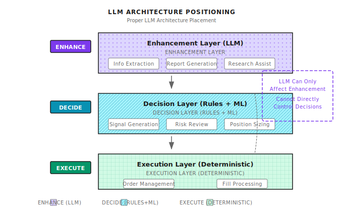
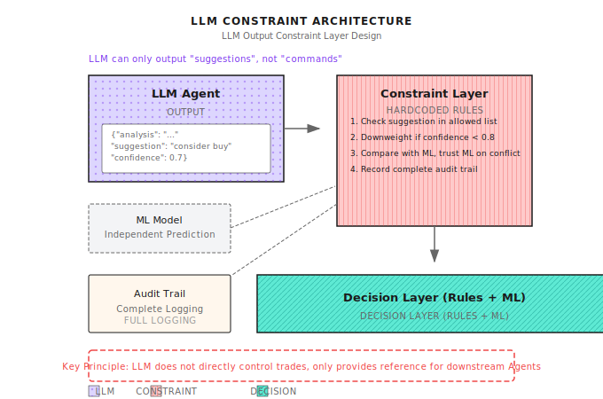

# Lesson 14: LLM Applications in Quant

> **LLM is the most powerful research assistant, but the worst trader. Let it do what it's good at.**

---

## The GPT Trader Fantasy vs Reality

In 2023, a team ran an experiment: let GPT-4 make trading decisions directly.

They gave GPT-4:
- Past 20 days of price data
- Latest financial news
- Current positions

Then asked: "Should we buy, sell, or hold?"

**Results after 3 months**:

| Metric | GPT-4 Strategy | Random Strategy | S&P 500 |
|--------|----------------|-----------------|---------|
| Return | -12% | -3% | +8% |
| Sharpe Ratio | -0.8 | -0.2 | 0.5 |
| Max Drawdown | 25% | 18% | 10% |

**GPT-4 even underperformed a random strategy.**

**Why did it fail?**

1. **Hallucination problem**: GPT-4 makes up non-existent "market patterns"
2. **Weak math ability**: Cannot accurately calculate returns, volatility
3. **No memory**: Each call is independent, cannot accumulate experience
4. **High latency**: One inference takes seconds, misses fast-moving markets
5. **Not reproducible**: Same input may produce different output

**But during the same period**, teams using GPT-4 for earnings analysis reported:

- Earnings interpretation quality improved 3x
- Research report generation time dropped from 4 hours to 30 minutes
- News sentiment analysis accuracy 85%

**Conclusion**: LLM isn't suitable for direct trading, but is powerful for research and analysis.

---

## 14.1 The Right Role for LLM

### What Can LLM Do?

| Capability | Quant Application | Value Rating |
|------------|-------------------|--------------|
| **Text understanding** | Earnings interpretation, news analysis | 5/5 |
| **Information extraction** | Extract key metrics from 10-K | 5/5 |
| **Report generation** | Strategy diagnostic reports, postmortem summaries | 4/5 |
| **Code generation** | Assist writing backtest code | 4/5 |
| **Knowledge Q&A** | Explain financial concepts | 3/5 |

### What Can't LLM Do?

| Attempt | Why It Fails | Alternative |
|---------|--------------|-------------|
| **Direct price prediction** | Cannot access real-time data, inaccurate calculations | Traditional ML models |
| **Real-time trading decisions** | Too much latency, not reproducible | Rules + ML systems |
| **Precise calculations** | High error rate on large numbers | Dedicated calculation modules |
| **Long-term memory** | Limited context, cannot accumulate | External knowledge bases |

### Core Principle: LLM as Enhancement Layer



---

## 14.2 News and Sentiment Analysis

### Application Scenarios

Extract trading-relevant information from financial news:

| News Type | Extracted Content | Quant Value |
|-----------|-------------------|-------------|
| **Earnings releases** | Beat/miss expectations, guidance changes | Event-driven signals |
| **Product news** | New launches, recalls, partnerships | Fundamental changes |
| **Macro policy** | Rate decisions, regulatory changes | Systemic risk |
| **Analyst opinions** | Rating changes, price target adjustments | Sentiment indicators |

### Sentiment Analysis Example

**Input News**:
> Apple reported quarterly revenue of $123 billion, beating Wall Street expectations of $118 billion. However, iPhone sales in China declined 15% year-over-year due to increased competition from Huawei.

**LLM Extraction**:
```json
{
  "company": "AAPL",
  "event_type": "earnings",
  "sentiment_overall": 0.6,
  "key_points": [
    {"topic": "revenue", "sentiment": 0.8, "value": "beat by 4%"},
    {"topic": "china_iphone", "sentiment": -0.7, "value": "-15% YoY"}
  ],
  "trading_signal": "mixed",
  "confidence": 0.7
}
```

**How to Use**:
- Don't trade directly, use as one input feature for signals
- Combine with price momentum, technical indicators
- Use historical data to validate LLM sentiment's predictive power (backtest)

### Prompt Engineering Key Points

**Bad prompt**:
> Is this news bullish or bearish?

**Good prompt**:
```
You are a financial analyst. Please analyze the following news:
[News content]

Please output in the following format:
1. Company/asset involved (ticker symbol)
2. Event type (earnings/product/policy/other)
3. Overall sentiment score (-1 to 1, -1 extremely negative, 1 extremely positive)
4. 3 key information points, each with topic, sentiment score, specific value
5. Possible short-term price impact (up/down/neutral)
6. Confidence (0 to 1)

Output JSON only, no explanation.
```

---

## 14.3 Earnings Report Automation

### 10-K/10-Q Information Extraction

US public company annual reports (10-K) and quarterly reports (10-Q) contain massive information, but typically exceed 100 pages.

**LLM can automatically extract**:

| Extracted Content | Location | Use |
|-------------------|----------|-----|
| Revenue growth | Financial Statements | Fundamental screening |
| Gross margin change | MD&A | Profitability trend |
| Risk factor changes | Risk Factors | Risk warning |
| Management discussion tone | MD&A | Sentiment indicator |
| Litigation progress | Legal Proceedings | Event risk |

### Structured Extraction Process

```
+-------------------+
|  Download 10-K PDF |
+--------+----------+
         |
         v
+-------------------+
|   PDF -> Text     |
+--------+----------+
         |
         v
+-------------------+
| Segment (by section) |
+--------+----------+
         |
         v
+-------------------+
| LLM extract per segment |  <- Process each segment separately to avoid context overflow
+--------+----------+
         |
         v
+-------------------+
| Store structured data | -> Database for backtesting
+-------------------+
```

### Earnings Tone Change Detection

Compare MD&A tone changes between consecutive earnings reports:

| Previous Statement | Current Statement | Signal |
|--------------------|-------------------|--------|
| "We expect growth" | "We remain cautiously optimistic" | Tone weakening |
| "Facing challenges" | "Facing significant challenges" | Risk intensifying |
| "Exploring" | "Have initiated" | Progress accelerating |

**Note**: Tone change is a **relative indicator** - needs historical comparison to be meaningful.

---

## 14.4 Research Report Generation

### Strategy Diagnostic Report

Let LLM help write postmortem reports:

**Input**:
```
Strategy name: Momentum Strategy v2.3
Time range: 2024-01-01 to 2024-03-31
Performance data:
  - Return: +8.5%
  - Benchmark return: +12.0%
  - Max drawdown: -6.2%
  - Sharpe ratio: 1.2
  - Turnover: 420%

Trade details: (attach CSV)
```

**LLM Output**:
```
# Momentum Strategy v2.3 Q1 2024 Postmortem

## Summary
Strategy underperformed benchmark by 3.5% in Q1, mainly due to consecutive
stop-losses during February's ranging period.

## Core Problem Diagnosis
1. **High turnover cost**: 420% turnover means ~2.1% annualized trading cost
2. **February anomaly**: February return -4.3%, 70% of total drawdown
3. **Sector concentration**: Tech stocks 65% of holdings, lacking diversification

## Improvement Recommendations
1. Add holding period filter to reduce short-term noise trades
2. Reduce position or pause strategy when ADX < 20
3. Add sector diversification constraint, single sector < 30%

## Next Steps
- [ ] Backtest performance after adding ADX filter
- [ ] Test effect of minimum holding period = 3 days
```

### Report Quality Control

LLM-generated reports need verification:

| Check Item | Risk | Response |
|------------|------|----------|
| **Data accuracy** | LLM may fabricate data | Extract key data from source, don't let LLM calculate |
| **Causal errors** | Correlation mistaken for causation | Human review key conclusions |
| **Missing important info** | Only sees partial input | Check if all input dimensions covered |

---

## 14.5 LLM Safety Constraints

### Why Need Hard Constraints?

LLM output is unreliable. If used directly for trading:

| Risk | Scenario | Consequence |
|------|----------|-------------|
| **Hallucination** | "Based on data, recommend full position buy" | Actual data doesn't support |
| **Calculation error** | "Return 15%" is actually 1.5% | Wrong decision |
| **Inconsistency** | Same question, different answers | Not reproducible |

### Hard Constraint Design



### Audit Trail

Every LLM call must be logged:

```json
{
  "timestamp": "2024-01-15 09:30:00",
  "input_prompt": "Analyze AAPL earnings...",
  "output_raw": "...",
  "output_parsed": {"sentiment": 0.6, ...},
  "model": "gpt-4-0125-preview",
  "temperature": 0.1,
  "action_taken": "Used as feature input to signal model",
  "final_decision": "No trade executed"
}
```

**Purposes**:
- Postmortem whether LLM misled decisions
- Detect LLM performance degradation for timely adjustment
- Regulatory compliance

---

## 14.6 LLM Agent Architecture

### Position in Multi-Agent System

```
+-------------------------------------------------------------+
|                      Meta Agent                              |
+----------------------------+--------------------------------+
                             |
    +------------------------+------------------------+
    |                        |                        |
    v                        v                        v
+---------+            +---------+              +---------+
|  LLM    |            | Signal  |              |  Risk   |
|Research |  --------> |  Agent  | -----------> |  Agent  |
|  Agent  |   Input    +---------+              +---------+
+---------+  Sentiment
             Features

LLM Agent Position:
  - Not on critical decision path
  - Only provides "reference information"
  - Downstream Agents decide whether to adopt
```

### LLM Agent Responsibility Boundaries

| Can Do | Cannot Do |
|--------|-----------|
| Analyze news sentiment | Directly generate buy/sell signals |
| Extract earnings data | Calculate position sizes |
| Generate report drafts | Modify risk control parameters |
| Explain strategy logic | Execute orders |
| Flag anomalous events | Disable stop-losses |

---

## 14.7 Practical Considerations

### Cost Control

| Scenario | Call Frequency | Cost Control Strategy |
|----------|----------------|----------------------|
| Real-time news analysis | Per news item | Pre-filter irrelevant news with rules |
| Earnings analysis | Quarterly | Cost acceptable |
| Daily report generation | Daily | Use caching to avoid duplicate calls |
| Real-time Q&A | On-demand | Limit daily call count |

### Latency Management

| Application | Acceptable Latency | Strategy |
|-------------|-------------------|----------|
| Event-driven trading | < 1 second | Don't use LLM, use rules |
| Daily strategies | Minutes | Can use LLM, batch processing |
| Research analysis | Hours | Use freely |

### Model Selection

| Task | Recommended Model | Reason |
|------|-------------------|--------|
| Sentiment analysis | GPT-3.5 / Claude Haiku | Simple task, low cost |
| Earnings analysis | GPT-4 / Claude Opus | Needs deep understanding |
| Code generation | Claude Opus / GPT-4 | Needs precision |
| Simple classification | Fine-tuned small model | Lowest cost, minimal latency |

---

## Lesson Deliverables

After completing this lesson, you will have:

1. **Clear understanding of LLM's role in quant** - Know what it can and cannot do
2. **Sentiment analysis capability** - Can design news/earnings LLM analysis workflows
3. **Safety constraint awareness** - Understand why hard constraints are necessary
4. **Architecture integration method** - Know how LLM Agent fits into multi-agent systems

### Acceptance Criteria

| Checkpoint | Acceptance Standard | Self-Test Method |
|------------|---------------------|------------------|
| **Role understanding** | Can name 3 things LLM can and cannot do each | List without notes |
| **Prompt design** | Can write structured sentiment analysis prompt | Given news, design prompt |
| **Safety constraints** | Can explain why LLM shouldn't trade directly | List 3 risks |
| **Architecture positioning** | Can mark LLM position in multi-Agent architecture diagram | Draw diagram |

**Design Exercise**:

Design an LLM news analysis workflow with requirements:
1. Process 500 financial news items daily
2. Latency requirement < 1 hour to complete all
3. Cost budget < $50/day
4. Output sentiment features for daily strategies

<details>
<summary>Click to see reference solution</summary>

**Workflow Design**:

1. **Pre-filtering** (rules):
   - Keyword filter, keep only news about held stocks
   - Expected to filter down to 100 items

2. **Batch processing**:
   - Use GPT-3.5-turbo ($0.002/1K tokens)
   - Each news ~500 tokens input + 200 tokens output
   - 100 items x 700 tokens x $0.002/1K = $0.14

3. **Parallel calls**:
   - 10 concurrent calls
   - ~3 seconds each, 100 items ~30 seconds total

4. **Output format**:
   ```json
   {
     "symbol": "AAPL",
     "sentiment": 0.6,
     "event_type": "earnings",
     "key_point": "beat expectations"
   }
   ```

5. **Post-processing**:
   - Aggregate multiple news items per stock
   - Calculate weighted average sentiment score
   - Store in feature database

**Cost Estimate**:
- $0.14/day x 30 days = $4.2/month
- Well below $50/day budget

</details>

---

## Lesson Summary

- [x] Understand LLM's correct role in quant: research assistant, not trader
- [x] Master news sentiment analysis and earnings information extraction applications
- [x] Recognize LLM risks: hallucination, calculation errors, not reproducible
- [x] Learn to design safety constraints: hard constraint layer + audit trail
- [x] Understand LLM Agent's position in multi-agent architecture

---

## Further Reading

- [Background: LLM Research in Quantitative Trading](../Part3-Machine-Learning/Background/LLM-Research-in-Quantitative-Trading.md) - Academic frontiers
- *GPT-4 Technical Report* - Understanding LLM capability boundaries

---

## Next Lesson Preview

**Lesson 15: Risk Control and Money Management**

Even the best strategy loses money - the key is "how much loss is acceptable." Risk Agent has veto power, it's the last line of defense for protecting capital. Next lesson we dive deep into the core logic of risk control.
