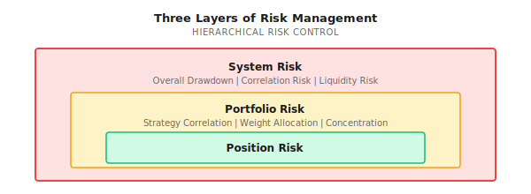
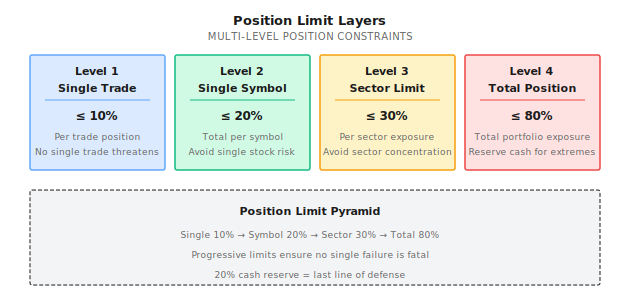
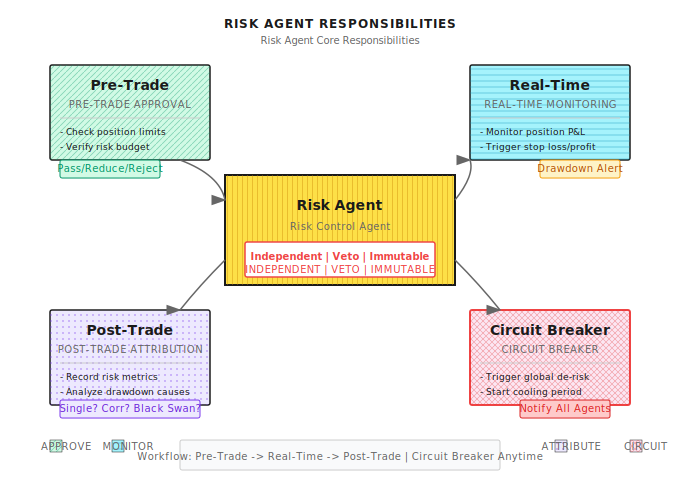
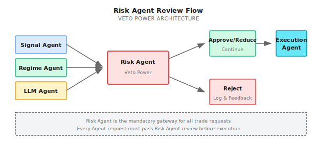

# Lesson 15: Risk Control and Money Management

> **Goal**: Understand that "surviving" is more important than "earning more," and master the design principles of Risk Agent.

---

## A Real Story (Public Case: LTCM, 1998)

> Note: The following is a simplified review of a public historical case, illustrating risk management points; details are based on public information.

In 1998, Long-Term Capital Management (LTCM) was Wall Street's most dazzling hedge fund. Founders included two Nobel Prize winners in economics, and the team gathered top mathematicians and traders.

Their strategy was simple: exploit tiny pricing discrepancies in bond markets for arbitrage. Backtests showed stable returns, risk appeared low.

The problem was they used **25x leverage**.

When the Russian debt crisis erupted in 1998, market panic caused liquidity to dry up. Those "tiny discrepancies" not only didn't converge, they expanded dramatically. LTCM's models assumed this was a "once in a century" event, but it happened.

Result: $4.6 billion in capital, wiped out in weeks. The Federal Reserve had to coordinate 14 major Wall Street banks for emergency rescue to prevent systemic collapse.

**What's the lesson?**
1. Model assumptions will fail, especially in extreme conditions
2. Leverage amplifies returns, but also amplifies risk
3. In liquidity crises, all asset correlations approach 1
4. **Risk control must be independent of strategy, with veto power**

This is why we need an independent **Risk Agent** - it doesn't care how much the strategy can earn, only whether the system will survive.

---

## 15.1 Three Layers of Risk

### Layered Risk Management



| Layer | Focus | Control Mechanism | Trigger Condition |
|-------|-------|-------------------|-------------------|
| **Position Risk** | Single trade loss | Stop-loss, position limits | Single trade loss reaches threshold |
| **Portfolio Risk** | Strategy stacking | Diversification, correlation monitoring | Portfolio drawdown reaches threshold |
| **System Risk** | Entire account survival | Circuit breaker, full position reduction | Account drawdown reaches threshold |

### Risk Budget Thinking

**Core idea**: First decide how much you can lose, then decide how much you can earn.

```
Total risk budget: 20% (maximum acceptable drawdown)
    |
    |-- Strategy A: 8% (momentum strategy, high volatility)
    |-- Strategy B: 6% (mean reversion, medium volatility)
    |-- Strategy C: 4% (arbitrage strategy, low volatility)
    +-- Reserve buffer: 2% (for extreme situations)
```

**Paper Exercise: Allocate Risk Budget**

You have $1M capital, maximum acceptable drawdown 15%. Three strategies:

| Strategy | Historical Max Drawdown | Annual Return | Sharpe Ratio |
|----------|------------------------|---------------|--------------|
| A | 25% | 35% | 1.4 |
| B | 12% | 18% | 1.5 |
| C | 8% | 12% | 1.5 |

**Question**: How to allocate weights so portfolio drawdown doesn't exceed 15%?

<details>
<summary>Click to expand answer</summary>

**Method 1: Equal Risk Contribution (Risk Parity)**

| Strategy | Drawdown | 1/Drawdown | Weight | Risk Contribution |
|----------|----------|------------|--------|-------------------|
| A | 25% | 0.04 | 0.04/0.215 = 18.6% | 25% x 18.6% = 4.6% |
| B | 12% | 0.083 | 0.083/0.215 = 38.6% | 12% x 38.6% = 4.6% |
| C | 8% | 0.125 | 0.125/0.215 = 58.1% | 8% x 58.1% = 4.6% |
| **Total** | | 0.215 | 115.3% (needs scaling) | 13.8% |

Scaled weights: A=16%, B=34%, C=50%, expected portfolio drawdown ~12% (below 15%)

**Method 2: Simplified Calculation**

If assuming strategies are uncorrelated, portfolio drawdown ~ sqrt(sum((weight x drawdown)^2))

Let A weight = x, solve sqrt((0.25x)^2 + (0.12x0.4)^2 + (0.08x0.5)^2) <= 15%

Solution: x <= 20%, so A max allocation 20%

**Key insight**: High volatility strategies must be underweighted, otherwise they dominate portfolio risk.

</details>

---

## 15.2 Position Management

### Kelly Formula: Theoretically Optimal Position

The Kelly formula tells you, given win rate and odds, what proportion to bet to maximize long-term wealth growth:

```
f* = (p x b - q) / b

Where:
- f* = Optimal position proportion
- p = Win rate
- q = 1 - p = Loss rate
- b = Odds (profit/loss ratio)
```

**Paper Exercise: Calculate Kelly Position**

| Scenario | Win Rate p | Odds b | Kelly f* | Interpretation |
|----------|------------|--------|----------|----------------|
| A | 60% | 1.0 | (0.6x1-0.4)/1 = 20% | Bet 20% each time |
| B | 55% | 1.5 | (0.55x1.5-0.45)/1.5 = 25% | Higher odds, can bet more |
| C | 50% | 1.0 | (0.5x1-0.5)/1 = 0% | Zero expectation, don't bet |
| D | 45% | 2.0 | (0.45x2-0.55)/2 = 17.5% | Low win rate but high odds |
| E | 70% | 0.5 | (0.7x0.5-0.3)/0.5 = 10% | High win rate low odds |

### Why Use "Half Kelly" in Practice

| Problem | Explanation | Solution |
|---------|-------------|----------|
| Estimation error | Win rate and odds are estimates, may be inaccurate | Use 1/2 Kelly or 1/4 Kelly |
| Too much volatility | Full Kelly volatility may be unbearable | Lower position for comfort |
| Ruin risk | Consecutive losses at full Kelly can wipe out | Set minimum position limits |
| Correlation | Kelly assumes independence, but positions may correlate | Apply discount at portfolio level |

**Practical recommendation**: Use Kelly/2 as position ceiling, combined with other constraints.

### Kelly and Parameter Uncertainty

**Core problem**: Kelly formula assumes you know the true win rate and odds, but these are actually estimates.

```
Impact of estimation error:

True win rate: 55%
Estimated win rate: 60% (overestimated by 5%)
Odds: 1.0

True Kelly: (0.55x1 - 0.45)/1 = 10%
Estimated Kelly: (0.60x1 - 0.40)/1 = 20% (overestimated by 100%!)

You use 20% position for a strategy that should only use 10%
-> Risk doubles, may blow up
```

#### Bayesian Kelly Formula

A method considering parameter uncertainty uses the Bayesian framework:

```python
import numpy as np
from scipy import stats

def bayesian_kelly(wins: int, losses: int,
                   avg_win: float, avg_loss: float,
                   confidence: float = 0.9) -> dict:
    """
    Bayesian Kelly: Consider win rate estimation uncertainty

    wins: Historical win count
    losses: Historical loss count
    avg_win: Average win percentage
    avg_loss: Average loss percentage
    confidence: Confidence level
    """
    n = wins + losses

    # Bayesian posterior for win rate (Beta distribution)
    # Using uniform prior Beta(1,1)
    alpha = wins + 1
    beta = losses + 1

    # Point estimate and interval for win rate
    p_mean = alpha / (alpha + beta)
    p_lower = stats.beta.ppf((1 - confidence) / 2, alpha, beta)
    p_upper = stats.beta.ppf((1 + confidence) / 2, alpha, beta)

    # Odds
    odds = avg_win / avg_loss

    # Kelly under different win rate assumptions
    kelly_mean = (p_mean * odds - (1 - p_mean)) / odds
    kelly_lower = (p_lower * odds - (1 - p_lower)) / odds
    kelly_upper = (p_upper * odds - (1 - p_upper)) / odds

    # Conservative Kelly: use confidence lower bound
    kelly_conservative = max(0, kelly_lower)

    return {
        'p_estimate': p_mean,
        'p_interval': (p_lower, p_upper),
        'kelly_mean': max(0, kelly_mean),
        'kelly_conservative': kelly_conservative,
        'kelly_interval': (max(0, kelly_lower), max(0, kelly_upper)),
        'sample_size': n,
        'recommendation': kelly_conservative / 2  # Half again
    }


# Example
result = bayesian_kelly(wins=60, losses=40, avg_win=0.02, avg_loss=0.015)

print(f"Win rate estimate: {result['p_estimate']:.1%}")
print(f"Win rate 90% CI: [{result['p_interval'][0]:.1%}, {result['p_interval'][1]:.1%}]")
print(f"Kelly (point estimate): {result['kelly_mean']:.1%}")
print(f"Kelly (conservative): {result['kelly_conservative']:.1%}")
print(f"Recommended position: {result['recommendation']:.1%}")
```

**Example output**:
```
Win rate estimate: 60.0%
Win rate 90% CI: [51.1%, 68.4%]
Kelly (point estimate): 26.7%
Kelly (conservative): 6.8%
Recommended position: 3.4%
```

**Key insights**:
- 100 trades estimate 60% win rate, true value may be 51%-68%
- Using point estimate Kelly (26.7%) is very risky
- Conservative Kelly (6.8%) based on win rate lower bound, safer
- Recommended position halved again (3.4%), leaving margin

#### Sample Size and Kelly Discount

| Historical Trade Count | Win Rate Estimation Error | Suggested Kelly Discount |
|-----------------------|--------------------------|-------------------------|
| < 30 | Extremely unreliable estimate | Don't use Kelly |
| 30-100 | +/-10-15% | Kelly x 0.25 |
| 100-300 | +/-5-10% | Kelly x 0.5 |
| 300-1000 | +/-3-5% | Kelly x 0.7 |
| > 1000 | +/-1-3% | Kelly x 0.8 |

**Paper Exercise: Kelly Discount**

| Scenario | Trade Count | Est. Win Rate | Est. Odds | Point Kelly | Discount | Actual Position |
|----------|-------------|---------------|-----------|-------------|----------|-----------------|
| A | 50 | 55% | 1.2 | 12.5% | 0.25 | 3.1% |
| B | 200 | 55% | 1.2 | 12.5% | 0.5 | 6.3% |
| C | 500 | 55% | 1.2 | 12.5% | 0.7 | 8.8% |

**Conclusion**: Fewer samples, larger Kelly discount. Never go full position with insufficient data.

### Position Limit Rules



---

## 15.3 Stop-Loss and Take-Profit

### Three Types of Stop-Loss

| Type | Definition | Pros | Cons |
|------|------------|------|------|
| **Fixed stop-loss** | Exit when loss reaches X% | Simple, certain | May be shaken out by volatility |
| **Trailing stop** | Exit when retracement from high is X% | Let profits run | May give back profits |
| **Time stop** | Exit if no profit after N days | Avoid capital tie-up | May miss subsequent moves |

### Stop-Loss Level Calculation

**Method 1: ATR Multiple**

```
Stop-loss price = Entry price - N x ATR

Where:
- ATR = Average True Range
- N = Multiple (typically 1.5 - 3)

Example:
- Entry price = $100
- ATR = $2
- N = 2
- Stop-loss price = $100 - 2 x $2 = $96 (4% stop-loss)
```

**Method 2: Volatility Adjusted**

```
Stop-loss range = k x sigma

Where:
- sigma = Daily volatility of the asset
- k = Multiple (typically 2 - 3)

Example:
- Daily volatility = 2%
- k = 2.5
- Stop-loss range = 2.5 x 2% = 5%
```

**Paper Exercise: Design Stop-Loss Strategy**

| Symbol | Entry Price | Daily Volatility | ATR | Fixed 5% Stop | ATRx2 Stop | Volx2.5 Stop |
|--------|-------------|------------------|-----|---------------|------------|--------------|
| AAPL | $180 | 1.5% | $2.7 | $171 | $174.6 | $173.3 |
| TSLA | $250 | 3.5% | $8.8 | $237.5 | $232.4 | $228.1 |
| SPY | $450 | 0.8% | $3.6 | $427.5 | $442.8 | $441 |

**Observations**:
- Fixed stop-loss is too tight for high volatility assets (TSLA), easily shaken out
- ATR/volatility stops auto-adjust based on asset characteristics
- Low volatility assets (SPY) can have tighter stops

### Psychological Traps in Stop-Loss

| Trap | Manifestation | Consequence |
|------|---------------|-------------|
| **Unwilling to stop** | "Wait a bit, it'll come back" | Small loss becomes big loss |
| **Premature stop** | Run at the first sign of loss | Frequently shaken out, lose on fees |
| **Trailing stop too tight** | Lock in small profits | Can't capture big moves |
| **Average down after loss** | "Lower my cost basis" | Increase bet on wrong direction |

**Core principle**: Stop-loss is part of the trading system, not a sign of failure.

### Common Misconceptions

**Misconception 1: High leverage only amplifies returns**

It also amplifies risk and emotional pressure. LTCM used 25x leverage, wiped out $4.6B in weeks. Leverage makes you earn more when right, but die faster when wrong.

**Misconception 2: Diversification = holding more symbols**

Holding 10 tech stocks isn't diversification. The core of diversification is **low correlation**, not number of symbols. Stocks + bonds + commodities diversifies far better than 10 stocks.

**Misconception 3: Risk control can be added after the fact**

Risk control must be designed upfront. Thinking about risk control after losing 30% is too late. Correct approach: Set stop-loss, position limits, and drawdown circuit breakers before opening positions.

**Misconception 4: Risk Agent's veto can be overridden by "better reasons"**

Absolutely not. Risk Agent's hard constraints are the system's safety boundaries - no reason can bypass them. This is the last defense preventing "one mistake destroys everything."

---

## 15.4 Portfolio Risk Management

### The Correlation Trap

**Problem**: You think you're diversified, but you're not.

| Portfolio | Looks Like | Actual Correlation | Crisis Correlation |
|-----------|------------|-------------------|-------------------|
| AAPL + MSFT + GOOGL | Three different companies | 0.7 | 0.9 |
| Stocks + Bonds | Different asset classes | 0.2 | 0.6 |
| US Stocks + HK Stocks | Different markets | 0.5 | 0.85 |
| Bitcoin + Ethereum | Two cryptocurrencies | 0.85 | 0.95 |

**Key insight**: Correlations spike in crises, exactly when you most need diversification - but it fails.

### Portfolio Drawdown Control

```
Portfolio Drawdown Monitoring Levels:

Warning (Yellow): Drawdown 5%
- Reduce new position sizes
- Increase stop-loss sensitivity

Control (Red): Drawdown 10%
- Stop new positions
- Start reducing positions

Circuit Breaker (Black): Drawdown 15%
- Full reduction to 30%
- Initiate cooling period (e.g., 5 days)
```

### Paper Exercise: Drawdown Scenario Simulation

**Initial state**: $1M capital, 80% position

| Day | Net Value | Drawdown | Trigger Level | Action |
|-----|-----------|----------|---------------|--------|
| 0 | $1M | 0% | - | Normal operation |
| 5 | $970K | 3% | - | Normal operation |
| 10 | $940K | 6% | Yellow | Reduce new positions, raise stops |
| 15 | $910K | 9% | Yellow | Continue controlling |
| 20 | $880K | 12% | Red | Stop opening, start reducing |
| 25 | $850K | 15% | Black | Reduce to 30%, cooling period |
| 30 | $860K | 14% | Red | Maintain 30% position |
| 35 | $890K | 11% | Red | Consider slowly adding |

---

## 15.5 Risk Agent Design

### Risk Agent Core Responsibilities



### Veto Power Design

| Scenario | Signal Agent Request | Risk Agent Decision | Reason |
|----------|---------------------|---------------------|--------|
| Normal | Buy 10% AAPL | Approve | Meets all limits |
| Excessive | Buy 15% AAPL | Reduce to 10% | Exceeds single trade limit |
| Concentrated | Buy 10% MSFT (already holding 15% AAPL) | Reject | Tech already exceeds sector limit |
| Drawdown | Add position | Reject | Portfolio triggered red level |
| Circuit breaker | Any buy | Reject | System in cooling period |

### Risk Agent Implementation Principles

```
1. Hard Constraints Cannot Be Overridden
   - Position limits, drawdown circuit breakers are hardcoded
   - Even if other Agents have "better reasons," cannot bypass
   - Human intervention requires special process (e.g., dual confirmation)

2. Independent Data Source
   - Risk Agent has its own market data source
   - Doesn't fully depend on data from other Agents
   - Prevents being "fed fake data" to bypass risk control

3. Complete Audit Logs
   - Every decision logged: time, request, decision, reason
   - Supports post-hoc review: "Why didn't we stop-loss that day?"
   - Logs cannot be modified

4. Degradation Strategy
   - If Risk Agent itself fails, system enters safe mode
   - Safe mode: No new positions allowed, only reductions
   - Cannot skip risk control because risk control is broken
```

<details>
<summary>Code Implementation (For Engineers)</summary>

```python
from dataclasses import dataclass
from enum import Enum
from typing import Optional
import logging

class Decision(Enum):
    APPROVE = "approve"
    REDUCE = "reduce"
    REJECT = "reject"

@dataclass
class RiskCheckResult:
    decision: Decision
    reason: str
    adjusted_size: Optional[float] = None

class RiskAgent:
    """Risk Control Agent - Has veto power"""

    def __init__(self, config: dict):
        self.max_single_position = config.get("max_single_position", 0.10)
        self.max_symbol_exposure = config.get("max_symbol_exposure", 0.20)
        self.max_sector_exposure = config.get("max_sector_exposure", 0.30)
        self.max_total_exposure = config.get("max_total_exposure", 0.80)
        self.drawdown_warning = config.get("drawdown_warning", 0.05)
        self.drawdown_stop = config.get("drawdown_stop", 0.10)
        self.drawdown_circuit = config.get("drawdown_circuit", 0.15)

        self.is_circuit_breaker_active = False
        self.logger = logging.getLogger("RiskAgent")

    def check_order(
        self,
        symbol: str,
        size: float,  # Proportion of total capital
        current_portfolio: dict,
        current_drawdown: float
    ) -> RiskCheckResult:
        """
        Review order request

        Returns: Approve/Reduce/Reject
        """

        # Check circuit breaker status
        if self.is_circuit_breaker_active:
            return RiskCheckResult(
                Decision.REJECT,
                "Circuit breaker active - no new positions"
            )

        # Check drawdown status
        if current_drawdown >= self.drawdown_stop:
            return RiskCheckResult(
                Decision.REJECT,
                f"Drawdown {current_drawdown:.1%} >= stop threshold"
            )

        # Check single trade limit
        if size > self.max_single_position:
            return RiskCheckResult(
                Decision.REDUCE,
                f"Size {size:.1%} > max {self.max_single_position:.1%}",
                adjusted_size=self.max_single_position
            )

        # Check symbol concentration
        current_symbol_exposure = current_portfolio.get(symbol, 0)
        if current_symbol_exposure + size > self.max_symbol_exposure:
            allowed = self.max_symbol_exposure - current_symbol_exposure
            if allowed <= 0:
                return RiskCheckResult(
                    Decision.REJECT,
                    f"Symbol {symbol} already at max exposure"
                )
            return RiskCheckResult(
                Decision.REDUCE,
                f"Reducing to stay within symbol limit",
                adjusted_size=allowed
            )

        # Check total position
        total_exposure = sum(current_portfolio.values()) + size
        if total_exposure > self.max_total_exposure:
            return RiskCheckResult(
                Decision.REJECT,
                f"Total exposure {total_exposure:.1%} would exceed limit"
            )

        return RiskCheckResult(Decision.APPROVE, "All checks passed")

    def check_drawdown(self, current_drawdown: float) -> str:
        """Check drawdown status and return recommendation"""

        if current_drawdown >= self.drawdown_circuit:
            self.is_circuit_breaker_active = True
            self.logger.critical(f"CIRCUIT BREAKER TRIGGERED: {current_drawdown:.1%}")
            return "circuit_breaker"

        if current_drawdown >= self.drawdown_stop:
            self.logger.warning(f"STOP LEVEL: {current_drawdown:.1%}")
            return "stop_new_positions"

        if current_drawdown >= self.drawdown_warning:
            self.logger.info(f"WARNING LEVEL: {current_drawdown:.1%}")
            return "reduce_risk"

        return "normal"
```

</details>

---

## 15.6 Risk Control in Multi-Agent Collaboration

### Risk Agent's Relationship with Other Agents



### Collaboration During Crisis

| State | Regime Agent | Signal Agent | Risk Agent | Execution Agent |
|-------|--------------|--------------|------------|-----------------|
| Normal | Identify trend/ranging | Normal signals | Normal review | Normal execution |
| Warning | Flag "possible crisis" | Reduce signal frequency | Raise review standard | Reduce order sizes |
| Crisis | Flag "crisis confirmed" | Stop long signals | Start reducing | Prioritize closing |
| Circuit breaker | - | Stop all signals | Force reduce to target | Only execute closes |

### Risk Attribution

| Attribution Dimension | Problem | Improvement Direction |
|----------------------|---------|----------------------|
| **Symbol selection** | One symbol contributed 50% of drawdown | Lower weight limit for that symbol |
| **Strategy selection** | Trend strategy lost big in ranging | Strengthen Regime detection |
| **Timing selection** | Opened positions during high volatility | Lower position in high volatility |
| **Position too large** | Single trade loss exceeded expectation | Tighten position limits |
| **Stop-loss failure** | Stop-loss wasn't executed | Check stop-loss mechanism |

---

## Acceptance Criteria

After completing this lesson, use these standards to verify learning:

| Checkpoint | Standard | Self-Test Method |
|------------|----------|------------------|
| Understand risk layers | Can distinguish position/portfolio/system risk | Give examples of control mechanisms for each |
| Calculate Kelly position | Can use formula to calculate optimal position | Complete paper exercises |
| Design stop-loss strategy | Can design stops using ATR/volatility | Design stop rules for your strategy |
| Understand correlation trap | Can explain why diversification may fail | Explain crisis correlation changes |
| Design Risk Agent | Can describe Risk Agent's four responsibilities | Draw risk review flow chart |

### Comprehensive Exercise

**Design Your Risk Control System**:

1. Define your risk budget (maximum acceptable drawdown)
2. Design position limit rules (single trade/single symbol/sector/total)
3. Design stop-loss strategy (type, parameters)
4. Design drawdown trigger mechanism (warning/control/circuit breaker levels)
5. Describe how Risk Agent collaborates with other Agents

---

## Lesson Deliverables

After completing this lesson, you will have:

1. **Risk budget framework** - First decide how much you can lose, then allocate strategies
2. **Position management rules** - Kelly formula + multi-layer limits
3. **Stop-loss design method** - ATR/volatility stop calculations
4. **Risk Agent design template** - Four responsibilities + veto mechanism

---

## Lesson Summary

- [x] Understand three layers of risk management: position, portfolio, system
- [x] Master Kelly formula and practical adjustments
- [x] Understand stop-loss types and parameter selection
- [x] Understand correlation trap and portfolio risk
- [x] Master Risk Agent design principles: independent, veto power, cannot be overridden

---

## Appendix: Risk Metrics Quick Reference

> This table summarizes common risk metrics used in quantitative trading and their industry standards for quick reference.

### Core Risk Metrics

| Risk Metric | Excellent Standard | Acceptable Standard | Control Method |
|-------------|-------------------|---------------------|----------------|
| **Maximum Drawdown** | <10% (market neutral) / <15% (index enhanced) | <20% (market neutral) / <25% (index enhanced) | Dynamic stop-loss, position control |
| **Sharpe Ratio** | >2.0 | >1.0 | Optimize return-to-volatility ratio |
| **Annualized Volatility** | <8% (market neutral) / <15% (index enhanced) | <12% (market neutral) / <20% (index enhanced) | Volatility targeting strategy |
| **Downside Risk** | <5% | <10% | Asymmetric risk management |
| **Win Rate** | >55% | >50% | Signal quality improvement |
| **Profit/Loss Ratio** | >2.0 | >1.5 | Let profits run, cut losses |
| **Calmar Ratio** | >1.5 | >0.5 | Annual return / Maximum drawdown |

### Position Control Standards

| Limit Type | Conservative Standard | Aggressive Standard | Description |
|------------|----------------------|---------------------|-------------|
| Single Trade Risk | 1% | 2% | Maximum loss per trade as % of total capital |
| Single Symbol Position | 5% | 10% | Single stock as % of total capital |
| Sector Concentration | 20% | 30% | Single sector as % of total capital |
| Total Position | 60-80% | 80-100% | Stocks as % of total capital |
| Leverage | 1x | 1.5x | Not recommended >1x unless professional institution |

### Drawdown Trigger Mechanism

| Drawdown Level | Action | Description |
|----------------|--------|-------------|
| 5% | Warning | Start monitoring, check positions |
| 10% | Reduce | Lower position by 20-30% |
| 15% | Control | Stop new positions, continue reducing |
| 20% | Circuit Breaker | Force reduce to minimum level |

---

## Further Reading

- [Background: Famous Quant Disasters](../Part1-Quick-Start/Background/Famous-Quant-Disasters.md) - LTCM and other risk control failure cases
- [Background: Statistical Traps of Sharpe Ratio](../Part2-Quant-Fundamentals/Background/Statistical-Traps-of-Sharpe-Ratio.md) - Statistical pitfalls in strategy evaluation
- [Lesson 12: Regime Detection](Lesson-12-Regime-Detection.md) - Crisis detection and risk control coordination
- [Lesson 10: From Models to Agents](../Part3-Machine-Learning/Lesson-10-From-Models-to-Agents.md) - Basics of Agent design

---

## Next Lesson Preview

**Lesson 16: Portfolio Construction and Exposure Management**

With multiple strategy signals, how do you combine them into a portfolio? How do you allocate positions? How do you monitor factor exposures? Next lesson we dive into the portfolio layer - the critical step from Signal to Portfolio.
