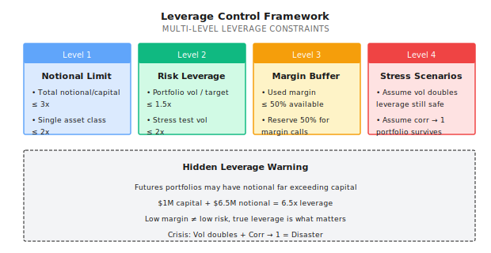
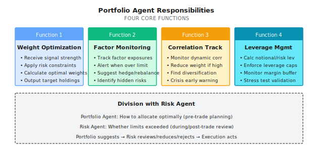

# Lesson 16: Portfolio Construction and Exposure Management

> **Multi-strategy does not equal low risk. Correlation is the essence of risk.**

---

## A Typical Scenario (Illustrative)

> Note: The following is a synthetic example to illustrate common phenomena; numbers are illustrative and don't correspond to any specific individual/account.

In early 2022, an investor showed me their "diversified portfolio":

| Strategy | Type | Historical Sharpe | Historical Max DD | Allocation |
|----------|------|-------------------|-------------------|------------|
| Strategy A | US Stock Momentum | 1.5 | 18% | 30% |
| Strategy B | Tech Stock Trend | 1.8 | 22% | 25% |
| Strategy C | Growth Factor | 1.3 | 15% | 25% |
| Strategy D | Long Rotation | 1.4 | 20% | 20% |

They asked me: "These four strategies are all excellent, combining them should be more stable, right?"

I did a simple correlation analysis:

| | Strategy A | Strategy B | Strategy C | Strategy D |
|---|------------|------------|------------|------------|
| Strategy A | 1.00 | 0.85 | 0.78 | 0.82 |
| Strategy B | 0.85 | 1.00 | 0.88 | 0.80 |
| Strategy C | 0.78 | 0.88 | 1.00 | 0.75 |
| Strategy D | 0.82 | 0.80 | 0.75 | 1.00 |

**Finding**: All strategy correlations are above 0.75.

**Result**: In 2022, this "diversified portfolio" drew down 35% - worse than any single strategy.

**Why?**

These four strategies look different, but they're all doing the same thing: **going long US tech stocks**. When tech stocks declined as a group, they all lost simultaneously, correlations approached 1, diversification effect vanished.

**This is the cost of lacking a portfolio layer** - you think you're diversifying risk, but actually stacking the same bet.

---

## 16.1 The Necessity of a Portfolio Layer

### 16.1.1 Standard Quant Flow

```
A complete quant system should be:

Signals -> Portfolio Optimization -> Risk Control -> Execution
 |              |                      |              |
 +-- Each       +-- Unified            +-- Secondary  +-- Real
    Strategy       Allocation             Review         Trading
    Signal

Many systems are missing the "Portfolio Optimization" layer:

Signals -> [Missing] -> Risk Control -> Execution
 |                          |              |
 +-- Direct trading         +-- Passive    +-- May
    from signals               checking       explode
```

### 16.1.2 What Problems Does the Portfolio Layer Solve?

| Problem | Without Portfolio Layer | With Portfolio Layer |
|---------|------------------------|---------------------|
| **Weight allocation** | Gut feel, equal weight | Based on risk contribution, optimization objective |
| **Correlation** | Don't know strategy relationships | Explicitly modeled and controlled |
| **Factor exposure** | Hidden exposures invisible | Monitored and constrained |
| **Leverage control** | May have hidden leverage | Explicitly calculate true leverage |
| **Rebalancing** | Random, passive | Rule-based, proactive |

### 16.1.3 Signal Quality Does Not Equal Portfolio Quality

This is a key distinction many overlook:

```
Single Strategy View:
  Strong signal -> Big position -> High return

Portfolio View:
  Strong signal + High correlation -> Big position -> Concentrated risk -> May lose big
  Strong signal + Low correlation -> Big position -> Diversified risk -> More robust
```

---

## 16.2 Position Sizing Methods

### 16.2.1 Four Common Methods Compared

| Method | Formula | Pros | Cons | Use Case |
|--------|---------|------|------|----------|
| **Equal Weight** | w_i = 1/N | Simple | Ignores risk differences | Similar strategy risks |
| **Equal Volatility** | w_i proportional to 1/sigma_i | Considers volatility | Ignores correlation | Independent strategies |
| **Equal Risk Contribution** | RC_i = RC_j | Risk balanced | Complex calculation | Long-term allocation |
| **Mean-Variance** | max(return/risk) | Theoretically optimal | High estimation error | When expectations are reliable |

### 16.2.2 Equal Weight vs Equal Risk Contribution

**Paper Exercise**:

You have two strategies:
- Strategy A: 10% annualized volatility
- Strategy B: 30% annualized volatility

| Method | Strategy A Weight | Strategy B Weight | Portfolio Volatility |
|--------|-------------------|-------------------|---------------------|
| Equal Weight | 50% | 50% | ? |
| Equal Volatility | 75% | 25% | ? |

<details>
<summary>Click to expand answer</summary>

Assuming correlation = 0 (independent)

**Equal Weight Allocation**:
- A volatility contribution = 50% x 10% = 5%
- B volatility contribution = 50% x 30% = 15%
- Portfolio volatility = sqrt(5%^2 + 15%^2) = sqrt(0.25% + 2.25%) = 15.8%
- **B contributes 90% of the risk**

**Equal Volatility Allocation**:
- w_A = (1/10%) / (1/10% + 1/30%) = 0.1 / 0.133 = 75%
- w_B = (1/30%) / (1/10% + 1/30%) = 0.033 / 0.133 = 25%
- A volatility contribution = 75% x 10% = 7.5%
- B volatility contribution = 25% x 30% = 7.5%
- Portfolio volatility = sqrt(7.5%^2 + 7.5%^2) = 10.6%
- **Both contribute equal risk**

**Conclusion**: Equal weight allocation lets high volatility strategies dominate portfolio risk.

</details>

### 16.2.3 Kelly at the Portfolio Level

Single strategy Kelly:
```
f* = (p x b - q) / b
```

Multi-strategy Kelly (considering correlation):
```
f* = Sigma^(-1) x mu

Where:
- f* = Optimal weight vector
- Sigma = Covariance matrix
- mu = Expected return vector

Key:
- High correlation strategies get down-weighted
- Negative correlation strategies get up-weighted
```

**Practical recommendation**:
- Use 1/2 Kelly or 1/4 Kelly
- Use robust estimation for covariance matrix (see next section)
- Set single strategy weight caps

---

## 16.3 Covariance Estimation and Shrinkage

### 16.3.1 Problems with Sample Covariance

Mean-variance optimization needs covariance matrix Sigma. The natural approach is to estimate from historical data:

```
Sample Covariance Matrix:
Sigma_hat = (1/T) x Sum((r_t - mu_hat)(r_t - mu_hat)')

Where:
  r_t = Return vector at time t
  mu_hat = Sample mean vector
  T = Number of samples
```

**Problem**: When asset count N approaches sample count T, the sample covariance matrix becomes extremely unstable.

**Paper Exercise**:

| Scenario | Assets N | Samples T | Problem |
|----------|----------|-----------|---------|
| 30 stocks, 1 year daily | 30 | 252 | OK, T/N ~ 8 |
| 100 stocks, 1 year daily | 100 | 252 | Dangerous, T/N ~ 2.5 |
| 500 stocks, 1 year daily | 500 | 252 | Disaster, T/N < 1 |

**Why small T/N causes problems**:

```
1. High estimation noise
   - Covariance matrix has N x (N+1)/2 parameters
   - 100 stocks = 5,050 parameters
   - 252 samples estimating 5,050 parameters -> extremely unreliable

2. Matrix may be singular
   - When N > T, Sigma_hat is singular (determinant = 0)
   - Cannot invert -> cannot do portfolio optimization

3. Extreme weights
   - Estimation errors get amplified by optimizer
   - Produces unreasonable large weights or short positions
```

### 16.3.2 Ledoit-Wolf Shrinkage Estimation

**Core idea**: "Shrink" the unstable sample covariance matrix toward a stable target matrix.

```
Shrinkage estimate:
Sigma_shrunk = delta x F + (1-delta) x Sigma_hat

Where:
  F = Target matrix (structured, stable)
  Sigma_hat = Sample covariance matrix (unbiased but noisy)
  delta = Shrinkage intensity (0 <= delta <= 1)

When delta -> 1: Approaches target matrix (stable but biased)
When delta -> 0: Approaches sample matrix (unbiased but noisy)
```

**Common Target Matrices**:

| Target Type | Definition | Use Case |
|-------------|------------|----------|
| **Single factor model** | F = beta x beta' x sigma_m^2 + D | Stock portfolios |
| **Constant correlation** | All assets have same correlation | Same asset class |
| **Diagonal matrix** | Keep only variances, correlations = 0 | Weakly correlated assets |

### 16.3.3 Code Implementation

```python
import numpy as np
from sklearn.covariance import LedoitWolf, OAS

def get_shrunk_covariance(returns: np.ndarray, method: str = 'ledoit_wolf') -> dict:
    """
    Calculate shrinkage covariance matrix

    Parameters:
    -----------
    returns : Returns matrix (T x N), each row is a period, each column is an asset
    method : 'ledoit_wolf' or 'oas' (Oracle Approximating Shrinkage)

    Returns:
    --------
    dict : Contains shrinkage covariance matrix and shrinkage intensity
    """
    if method == 'ledoit_wolf':
        estimator = LedoitWolf()
    elif method == 'oas':
        estimator = OAS()
    else:
        raise ValueError(f"Unknown method: {method}")

    estimator.fit(returns)

    return {
        'covariance': estimator.covariance_,
        'shrinkage': estimator.shrinkage_,
        'sample_cov': np.cov(returns, rowvar=False)
    }


def compare_covariance_stability(returns: np.ndarray, n_splits: int = 5) -> dict:
    """
    Compare stability of sample vs shrinkage covariance

    By splitting data, compare consistency of both methods across subsamples
    """
    T, N = returns.shape
    split_size = T // n_splits

    sample_covs = []
    shrunk_covs = []

    for i in range(n_splits):
        start = i * split_size
        end = start + split_size
        subset = returns[start:end]

        sample_covs.append(np.cov(subset, rowvar=False))

        lw = LedoitWolf()
        lw.fit(subset)
        shrunk_covs.append(lw.covariance_)

    # Calculate differences across subsamples (Frobenius norm)
    sample_diffs = []
    shrunk_diffs = []

    for i in range(n_splits):
        for j in range(i+1, n_splits):
            sample_diffs.append(np.linalg.norm(sample_covs[i] - sample_covs[j], 'fro'))
            shrunk_diffs.append(np.linalg.norm(shrunk_covs[i] - shrunk_covs[j], 'fro'))

    return {
        'sample_cov_variation': np.mean(sample_diffs),
        'shrunk_cov_variation': np.mean(shrunk_diffs),
        'stability_improvement': np.mean(sample_diffs) / np.mean(shrunk_diffs)
    }
```

### 16.3.4 Usage Example

```python
import numpy as np
from sklearn.covariance import LedoitWolf

# Simulate 50 stocks, 1 year daily data
np.random.seed(42)
n_assets = 50
n_days = 252

# Generate returns with factor structure (more realistic)
factor_returns = np.random.normal(0.0005, 0.015, n_days)
betas = np.random.uniform(0.5, 1.5, n_assets)
idio_returns = np.random.normal(0, 0.02, (n_days, n_assets))
returns = np.outer(factor_returns, betas) + idio_returns

# Sample covariance
sample_cov = np.cov(returns, rowvar=False)

# Ledoit-Wolf shrinkage covariance
lw = LedoitWolf()
lw.fit(returns)
shrunk_cov = lw.covariance_

print(f"Asset count: {n_assets}")
print(f"Sample count: {n_days}")
print(f"T/N ratio: {n_days/n_assets:.2f}")
print(f"Shrinkage intensity delta: {lw.shrinkage_:.3f}")
print(f"Sample cov condition number: {np.linalg.cond(sample_cov):.0f}")
print(f"Shrunk cov condition number: {np.linalg.cond(shrunk_cov):.0f}")

# Example output:
# Asset count: 50
# Sample count: 252
# T/N ratio: 5.04
# Shrinkage intensity delta: 0.234
# Sample cov condition number: 847
# Shrunk cov condition number: 142
```

**Interpretation**:
- Shrinkage intensity delta = 0.234 means 23.4% from target matrix, 76.6% from sample matrix
- Condition number dropped from 847 to 142, meaning more stable matrix, more reliable inversion

### 16.3.5 When to Use Shrinkage Estimation

| Scenario | T/N Ratio | Recommendation |
|----------|-----------|----------------|
| T/N > 10 | Comfortable | Sample covariance acceptable, limited shrinkage improvement |
| 5 < T/N <= 10 | Borderline | Recommend shrinkage, notable improvement |
| 2 < T/N <= 5 | Dangerous | Must use shrinkage |
| T/N <= 2 | Disaster | Shrinkage + Dimensionality reduction (factor model) |

**Practical recommendations**:

```
1. Default to shrinkage estimation
   - Even with high T/N, shrinkage won't hurt
   - sklearn automatically computes optimal shrinkage intensity

2. Rolling windows need shrinkage even more
   - Rolling window = fewer samples
   - Shrinkage helps smooth covariance changes

3. Combine with factor models
   - Large portfolios (>100 assets) use factor models for dimensionality reduction
   - Apply shrinkage to residual covariance
```

---

## 16.4 Factor Exposure Management

### 16.4.1 What Is Factor Exposure?

**Factors** are common sources driving asset returns. Common factors:

| Factor Type | Factor Name | Meaning |
|-------------|-------------|---------|
| **Market Factor** | Beta | Sensitivity to overall market |
| **Style Factors** | Size | Large cap vs Small cap |
| | Value | Value stocks vs Growth stocks |
| | Momentum | Past winners vs losers |
| | Quality | High quality vs Low quality |
| | Volatility | Low vol vs High vol |
| **Industry Factors** | Sector | Industry exposure |

### 16.4.2 Hidden Factor Exposure

**Problem**: You may not know what factors you're betting on.

```
Case: Four "Different" Strategies

Strategy A: Buy high ROE stocks
Strategy B: Buy low PE stocks
Strategy C: Buy financially solid stocks
Strategy D: Buy high dividend stocks

Looks like: Four different stock selection methods
Actually: All going long "Quality + Value" factor

Result: When Value factor fails (e.g., 2019-2020), all four strategies lose simultaneously
```

### 16.4.3 Factor Exposure Calculation

**Paper Exercise**:

Your portfolio holds:

| Stock | Weight | Size Beta | Value Beta | Momentum Beta |
|-------|--------|-----------|------------|---------------|
| AAPL | 30% | 0.8 (large) | -0.5 (growth) | 0.6 |
| MSFT | 25% | 0.7 (large) | -0.3 (growth) | 0.4 |
| JPM | 25% | 0.9 (large) | 0.8 (value) | -0.2 |
| XOM | 20% | 1.0 (large) | 1.2 (value) | -0.5 |

Calculate portfolio factor exposures:

<details>
<summary>Click to expand answer</summary>

**Size Exposure**:
= 30% x 0.8 + 25% x 0.7 + 25% x 0.9 + 20% x 1.0
= 0.24 + 0.175 + 0.225 + 0.2
= **0.84 (tilted large cap)**

**Value Exposure**:
= 30% x (-0.5) + 25% x (-0.3) + 25% x 0.8 + 20% x 1.2
= -0.15 - 0.075 + 0.2 + 0.24
= **0.215 (slightly value tilted)**

**Momentum Exposure**:
= 30% x 0.6 + 25% x 0.4 + 25% x (-0.2) + 20% x (-0.5)
= 0.18 + 0.1 - 0.05 - 0.1
= **0.13 (slightly momentum tilted)**

**Interpretation**:
- Portfolio tilts toward large cap (may passively follow market)
- Portfolio slightly tilts value factor (but not strong)
- Portfolio has slight momentum exposure

</details>

### 16.4.4 Factor Neutralization

If you want a factor-neutral portfolio:

```
Goal: Factor exposure ~ 0

Method 1: Constrained Optimization
  max  Expected return
  s.t. Factor exposure = 0
       Sum of weights = 1
       Weights >= 0

Method 2: Hedging
  If portfolio has 0.5 Value exposure
  Short 0.5 units of Value factor ETF

Method 3: Pair Trading
  For each Value stock bought
  Also buy a Growth stock (with equal Value Beta)
```

---

## 16.5 Hidden Leverage

### 16.5.1 What Is Hidden Leverage?

**Explicit leverage**: Borrow money to buy stocks, $1M capital + $1M borrowed = 2x leverage

**Hidden leverage**: No borrowing, but portfolio risk exposure exceeds capital

```
Case: Futures Portfolio

Capital: $1M
Holdings:
  - Stock index futures long: $2M notional (20% margin)
  - Bond futures long: $3M notional (15% margin)
  - Commodity futures long: $1.5M notional (15% margin)

Margin used: $500K
Idle cash: $500K

Appears to be: Only using 50% of capital
Actually: $6.5M notional exposure = 6.5x leverage!
```

### 16.5.2 Calculating True Leverage

```
True leverage = Sum(|Notional exposure|) / Capital

Or from risk perspective:

Risk leverage = Portfolio volatility / Benchmark volatility

Example:
  Portfolio annualized volatility: 30%
  S&P 500 volatility: 15%
  Risk leverage = 30% / 15% = 2x
```

### 16.5.3 Leverage Traps

| Trap | Manifestation | Consequence |
|------|---------------|-------------|
| **Low margin illusion** | "Only using 20% margin" | Actual leverage may be 5x |
| **Cross-asset stacking** | Futures across multiple asset classes | Hidden leverage stacking |
| **Correlation underestimation** | "Different assets, diversified risk" | Correlations spike in crisis |
| **Volatility underestimation** | Calculate leverage using normal volatility | Volatility doubles in crisis |

### 16.5.4 Leverage Control Framework



---

## 16.6 Multi-Strategy Portfolio Pitfalls

### 16.6.1 The Two Faces of Correlation

**Normal period**: Strategy correlation = 0.3 (diversification works)

**Crisis period**: Strategy correlation -> 0.9 (diversification fails)

```
Why does correlation spike in crises?

1. Liquidity squeeze
   Everyone is selling -> All assets drop

2. Risk preference reversal
   "Risk-off" -> Only buy treasuries, sell everything else

3. Leverage liquidation
   Margin calls -> Forced selling -> Prices drop -> More margin calls

4. Panic contagion
   One market crashes -> Investors panic -> Sell all risk assets
```

### 16.6.2 Drawdown Synchronization Problem

**Paper Exercise**:

You have three strategies, each with 15% historical max drawdown.

| Assumption | Portfolio Max Drawdown | Calculation |
|------------|----------------------|-------------|
| Completely independent (correlation = 0) | ? | Won't drawdown simultaneously |
| Partially correlated (correlation = 0.5) | ? | May partially sync |
| Highly correlated (correlation = 0.9) | ? | Almost fully sync |

<details>
<summary>Click to expand answer</summary>

**Simplified estimation** (equal weight):

1. **Completely independent**:
   - Probability of simultaneous max drawdown is very low
   - Portfolio max drawdown ~ 8-10% (single strategy contributes ~15%/3 = 5%, plus some sync)

2. **Partially correlated**:
   - Will have some synchronized drawdown
   - Portfolio max drawdown ~ 12-13%

3. **Highly correlated**:
   - Almost fully synchronized
   - Portfolio max drawdown ~ 14-15% (approaching single strategy)

**Key insight**: With high correlation, "diversification" is an illusion.

</details>

### 16.6.3 Strategy Capacity Constraints

| Strategy Type | Typical Capacity | Reason |
|---------------|------------------|--------|
| HFT market making | $10-100M | Liquidity constraints |
| Statistical arbitrage | $100M-1B | Alpha decay |
| Momentum strategies | $1-10B | Market impact |
| Passive index | Unlimited | Tracking error tolerance |

**Problem**: When strategy capacity is insufficient, continuing to add capital causes:
- Increased slippage
- Alpha decay
- Diminishing marginal returns

---

## 16.7 Multi-Agent Perspective

### 16.7.1 Portfolio Agent Responsibilities



### 16.7.2 Division with Risk Agent

| Dimension | Portfolio Agent | Risk Agent |
|-----------|-----------------|------------|
| **Focus** | How to allocate optimally | Whether limits exceeded |
| **Timing** | Pre-trade (planning stage) | During and post-trade (execution and monitoring) |
| **Authority** | Recommend weights | Veto power |
| **Tools** | Optimizer, factor models | Thresholds, circuit breakers |

**Collaboration Flow**:

```
Signal Agents --> Portfolio Agent --> Risk Agent --> Execution Agent
                       |                   |
                       v                   v
                  Optimal weights    Review/Reduce/Reject
                  Factor exposures       Leverage check
                  Correlations          Drawdown check
```

### 16.7.3 Portfolio Optimization Frequency

| Frequency | Use Case | Cost |
|-----------|----------|------|
| Intraday | HFT strategies | High trading costs |
| Daily | Active strategies | Moderate costs |
| Weekly | Tactical allocation | Low costs |
| Monthly | Strategic allocation | Lowest costs |

**Recommendation**:
- Only rebalance when weight change exceeds threshold (e.g., 5%)
- Avoid over-trading costs

---

## Acceptance Criteria

After completing this lesson, use these standards to verify learning:

| Checkpoint | Standard | Self-Test Method |
|------------|----------|------------------|
| Understand portfolio layer necessity | Can explain signal quality != portfolio quality | Give counterexample |
| Calculate weight allocation | Can calculate weights using equal weight and equal risk methods | Complete paper exercises |
| Analyze factor exposure | Can calculate portfolio factor betas | Complete factor exercise |
| Identify hidden leverage | Can calculate true leverage of futures portfolio | Give example |
| Understand correlation trap | Can explain why crisis correlations spike | Analyze case |

---

## Lesson Deliverables

After completing this lesson, you will have:

1. **Position Sizing method comparison** - Equal weight, equal volatility, equal risk contribution
2. **Factor exposure calculation framework** - Identify hidden risk exposures in portfolio
3. **Leverage control rules** - Notional and risk leverage constraints
4. **Portfolio Agent design template** - Responsibilities and workflow for portfolio optimization

---

## Lesson Summary

- [x] Multi-strategy does not equal diversification, correlation determines diversification effect
- [x] Equal weight allocation lets high volatility strategies dominate portfolio risk
- [x] Factor exposure may be hidden, needs explicit monitoring
- [x] Hidden leverage comes from notional exposure exceeding capital
- [x] Crisis correlations spike, diversification effect fails

---

## Further Reading

- [Lesson 08: Beta, Hedging, and Market Neutrality](../Part2-Quant-Fundamentals/Lesson-08-Beta-Hedging-and-Market-Neutrality.md) - Basics of Beta and factors
- [Lesson 15: Risk Control and Money Management](Lesson-15-Risk-Control-and-Money-Management.md) - Risk control and portfolio layer collaboration
- [Background: Statistical Traps of Sharpe Ratio](../Part2-Quant-Fundamentals/Background/Statistical-Traps-of-Sharpe-Ratio.md) - Statistical issues in portfolio evaluation
- [Background: Famous Quant Disasters](../Part1-Quick-Start/Background/Famous-Quant-Disasters.md) - Cases of leverage out of control

---

## Next Lesson Preview

**Lesson 17: Online Learning and Strategy Evolution**

After the portfolio is built, markets change, strategies must evolve. How do you enable the system to continuously learn and self-update, rather than waiting until after a big loss to discover problems? Next lesson we explore online learning methods.
