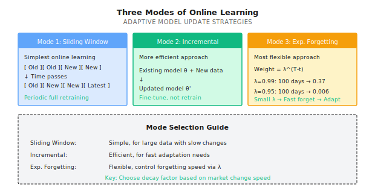
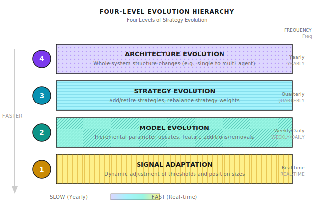
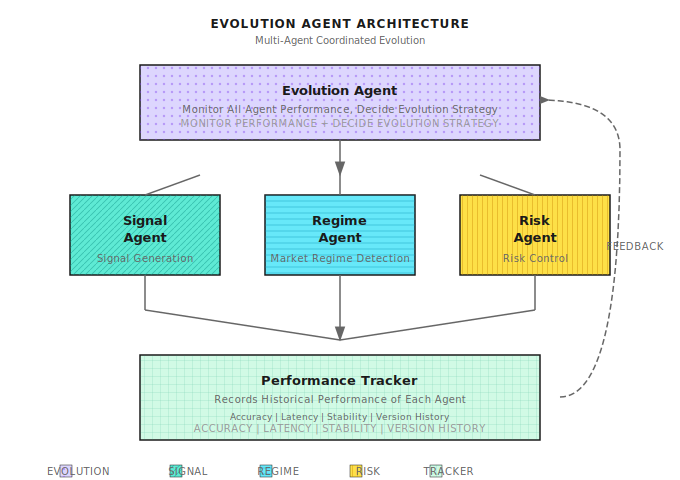
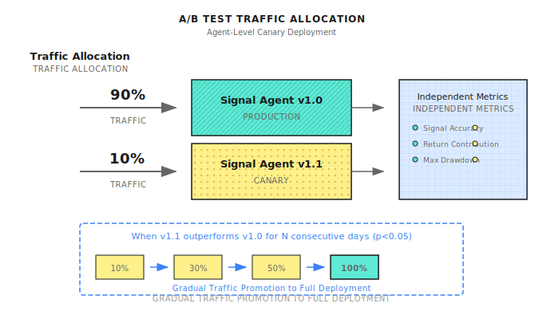

# Lesson 17: Online Learning and Strategy Evolution

> **Goal**: Understand why static models inevitably decay, and master the core mechanisms for continuous strategy evolution.

---

## A Typical Scenario (Illustrative)

> Note: The following is a synthetic example to illustrate common phenomena; numbers are illustrative and don't correspond to any specific individual/account.

In 2018, a quant trader developed a Random Forest-based stock selection model for A-shares. Backtest showed 35% annual return, 1.8 Sharpe, excellent across all metrics.

For the first 6 months, the model performed stably, matching the backtest. Then, performance began to slowly decline. Not a sudden failure, but like a frog in slowly heating water - each month earning a bit less, drawing down a bit more.

12 months later, annualized returns dropped from 35% to 8%, barely beating the index.

He checked the code, no bugs. Checked the data, no errors. The model was running exactly as designed, just **no longer making money**.

**What went wrong?** The market changed, but the model didn't. In early 2018, retail investors dominated, momentum factors worked. By late 2018, institutional money entered, momentum factors were arbitraged away. The patterns the model learned were patterns of that specific period, not eternal truths.

This is **concept drift** - the data distribution the model learned from no longer matches the data distribution it's trading in. The model isn't wrong, the world changed.

---

## 17.1 Why Static Models Inevitably Decay

### Market Non-Stationarity

Financial markets have a fundamental characteristic: **non-stationarity**. This means:

1. **Statistical properties change**: Mean, variance, correlations are not constants
2. **Patterns expire**: Effective alpha gets discovered, arbitraged, disappears
3. **Participants adapt**: Your strategy profits -> Others copy -> Alpha decays

| Decay Type | Manifestation | Cause | Typical Cycle |
|------------|---------------|-------|---------------|
| **Sudden** | Fails one day | Policy change, black swan event | Unpredictable |
| **Gradual** | Returns slowly decline | Alpha arbitraged, market structure changes | 6-18 months |
| **Cyclical** | Good sometimes, bad others | Market state switching (bull/bear transitions) | Related to economic cycle |

### Paper Exercise: Calculate Alpha Decay

**Scenario**: Your factor IC = 0.05, assume market efficiency improvement causes IC to decay 5% per month.

**Calculation**:
```
Month    IC        Expected Annual (IC x sqrt(252) x sigma, assuming sigma=20%)
0      0.050      15.8%
6      0.050 x 0.95^6 = 0.037      11.7%
12     0.050 x 0.95^12 = 0.027      8.5%
18     0.050 x 0.95^18 = 0.020      6.3%
24     0.050 x 0.95^24 = 0.015      4.7%
```

**Conclusion**: Even with only 5% monthly decay, after 2 years your strategy returns are only 30% of the original.

**Self-check**: Calculate your current strategy's IC, assume 3%, 5%, 10% monthly decay, how long until it drops to unacceptable levels?

### Why "Periodic Retraining" Isn't Enough

Many people's solution is "retrain the model every month." This is better than static models, but has three problems:

| Problem | Explanation | Consequence |
|---------|-------------|-------------|
| **Information lag** | Monthly retraining means up to 30 days lag | One month delay reacting to market changes |
| **Insufficient samples** | New data is only 20 trading days | Too few training samples, high overfitting risk |
| **Catastrophic forgetting** | Complete retraining "forgets" historical patterns | Cannot handle similar historical situations |

**Correct approach**: Not "relearn," but "continuously adapt" - gradually adjust to new environments while retaining historical knowledge.

---

## 17.2 Core Mechanisms of Online Learning

### Batch vs Online Learning

| Dimension | Batch Learning | Online Learning |
|-----------|----------------|-----------------|
| **Data processing** | Collect all data, train once | Update with each new data point |
| **Update frequency** | Periodic (e.g., monthly) | Continuous (e.g., daily, per trade) |
| **Compute resources** | Concentrated consumption | Distributed consumption |
| **Adaptation speed** | Slow (up to one cycle lag) | Fast (real-time adaptation) |
| **Overfitting risk** | Lower (more data) | Higher (needs regularization) |

### Three Modes of Online Learning



### Paper Exercise: Choosing Forgetting Factor

**Scenario**: Your strategy is tested in two market environments.

| Environment | Average Duration | Suggested lambda | Effective Lookback (weight >10%) |
|-------------|-----------------|------------------|--------------------------------|
| Fast switching | 20 days | 0.90 | ~22 days |
| Medium switching | 60 days | 0.95 | ~44 days |
| Slow switching | 180 days | 0.99 | ~230 days |

**Formula**: Effective lookback days ~ ln(0.1) / ln(lambda)

**Self-check**: Based on your strategy's market environment, choose appropriate lambda value. What happens if you choose wrong?
- Lambda too large (forget too slowly): Adapt too late, lose in new environment
- Lambda too small (forget too fast): Overfit recent noise, poor stability

<details>
<summary>Code Implementation (For Engineers)</summary>

```python
class ExponentialMovingModel:
    """Online learning model with exponential forgetting"""

    def __init__(self, decay_factor: float = 0.95):
        self.lambda_ = decay_factor
        self.weights = None
        self.cumulative_weight = 0

    def update(self, X: np.ndarray, y: float, learning_rate: float = 0.01):
        """Incremental update"""
        if self.weights is None:
            self.weights = np.zeros(X.shape[0])

        # Predict
        pred = np.dot(self.weights, X)
        error = y - pred

        # Update weights (gradient descent with forgetting)
        self.weights = self.lambda_ * self.weights + learning_rate * error * X
        self.cumulative_weight = self.lambda_ * self.cumulative_weight + 1

        return pred, error

    def get_effective_lookback(self, threshold: float = 0.1) -> int:
        """Calculate effective lookback days"""
        return int(np.log(threshold) / np.log(self.lambda_))
```

</details>

---

## 17.3 Four Levels of Strategy Evolution

Online learning is only part of strategy evolution. A complete evolution system has four levels:



### Level 1: Signal Adaptation (Fastest)

Signal adaptation is the fastest evolution level, doesn't require retraining models.

**Example: Dynamic Threshold Adjustment**

```
Static threshold: Buy if signal > 0.5

Dynamic threshold:
- Calculate past N days signal distribution
- Threshold = Signal mean + k x Signal std
- High market volatility, threshold auto-increases, reduce trades
- Low market volatility, threshold auto-decreases, increase trades
```

**Paper Exercise**:

| Scenario | Signal Mean | Signal Std | k=1.5 Threshold | Interpretation |
|----------|-------------|------------|-----------------|----------------|
| Normal market | 0.3 | 0.15 | 0.525 | Moderate |
| High volatility | 0.35 | 0.25 | 0.725 | Stricter, reduce trades |
| Low volatility | 0.28 | 0.08 | 0.40 | Looser, increase trades |

### Level 2: Model Evolution (Medium Speed)

Model evolution involves parameter updates and feature engineering.

**Key Mechanism: Feature Importance Monitoring**

```
+-------------------------------------------------+
|           Feature Importance Change Monitoring   |
+----------------+-----------+-----------+---------+
| Feature        | 6 months ago | Now     | Trend  |
+----------------+-----------+-----------+---------+
| Momentum_20D   | 0.25      | 0.08      | Decaying |
| Volatility_30D | 0.15      | 0.22      | Strengthening |
| Volume_Ratio   | 0.18      | 0.05      | Failed |
| Earnings_Surprise | 0.12   | 0.18      | Effective |
+----------------+-----------+-----------+---------+

-> Decision: Lower momentum weight, remove volume ratio, increase volatility weight
```

**Evolution Trigger Conditions**:

| Trigger Signal | Threshold | Action |
|----------------|-----------|--------|
| Feature importance drop > 50% | 3 consecutive months | Lower weight or remove |
| New feature IC significant | p-value < 0.05 | Candidate for inclusion |
| Overall model IC drop > 30% | 2 consecutive months | Trigger model retraining |

### Level 3: Strategy Evolution (Slower)

Strategy evolution involves reconfiguring the strategy portfolio.

**Strategy Lifecycle Management**:

```
                    Incubation      Validation      Maturity        Decay
Return/Risk    ................ ............ ............... .........
               Paper trading    Small live      Main strategy    Phase out
               3-6 months       3-6 months      Indefinite       Indefinite

Entry criteria:     Backtest pass    Sharpe>1.0      Sharpe>1.5       Sharpe<0.8
                   Quality Gate   Live DD<15%   6 months positive  3 months losing

Capital allocation:  0%           5-10%           20-40%          Phase to zero
```

**Dynamic Weights for Strategy Portfolio**:

| Weight Method | Principle | Pros | Cons |
|---------------|-----------|------|------|
| **Equal weight** | 1/N per strategy | Simple, diversified | Doesn't distinguish quality |
| **Inverse volatility** | Weight proportional to 1/sigma | Risk balanced | Ignores return differences |
| **Sharpe proportional** | Weight proportional to Sharpe | Rewards good strategies | History doesn't predict future |
| **Kelly weight** | Weight = mu/sigma^2 | Theoretically optimal | Sensitive to estimation error |
| **Sliding window** | Based on recent N days performance | Adaptive | May chase performance |

**Paper Exercise: Strategy Weight Allocation**

| Strategy | Recent 3M Return | Recent 3M Volatility | Sharpe | Inverse Vol Weight | Sharpe Proportional |
|----------|-----------------|---------------------|--------|-------------------|---------------------|
| A | 8% | 5% | 1.6 | 0.40 (1/5 / total) | 0.44 (1.6/3.6) |
| B | 6% | 8% | 0.75 | 0.25 (1/8 / total) | 0.21 (0.75/3.6) |
| C | 10% | 8% | 1.25 | 0.25 | 0.35 (1.25/3.6) |

**Calculation process**:
- Inverse volatility: 1/5 = 0.20, 1/8 = 0.125, 1/8 = 0.125, total = 0.45
  - A: 0.20/0.45 = 0.44, B: 0.125/0.45 = 0.28, C: 0.28
- Sharpe proportional: total = 1.6 + 0.75 + 1.25 = 3.6
  - A: 1.6/3.6 = 0.44, B: 0.75/3.6 = 0.21, C: 1.25/3.6 = 0.35

### Level 4: Architecture Evolution (Slowest)

Architecture evolution is the most fundamental change, usually requires human intervention.

**Typical Architecture Evolution Path**:

```
Stage 1: Single Strategy
+-- One simple trend following strategy

Stage 2: Strategy Portfolio
+-- Trend + Mean Reversion + Momentum, fixed weights

Stage 3: Dynamic Portfolio
+-- Dynamically adjust strategy weights based on market state

Stage 4: Multi-Agent
+-- Expert Agents + Meta Agent + Risk Agent

Stage 5: Self-Evolving System
+-- System that can automatically discover, test, and deploy new strategies
```

**Architecture Evolution Trigger Conditions**:

| Signal | Description | Recommended Action |
|--------|-------------|-------------------|
| All strategies fail simultaneously | Not single strategy issue, architecture issue | Check if regime detection is failing |
| Correlation structure changes | Previously uncorrelated strategies become highly correlated | Redesign strategy division of labor |
| Systemic drawdown > 30% | Risk control failed to prevent large drawdown | Strengthen Risk Agent veto power |
| New market state appears | E.g., crypto, new regulatory environment | Add new expert Agent |

---

## 17.4 Key Technologies for Implementing Online Learning

### 1. Concept Drift Detection

Before updating models, confirm whether drift has actually occurred.

**Common Detection Methods**:

| Method | Principle | Use Case |
|--------|-----------|----------|
| **DDM (Drift Detection Method)** | Monitor error rate, alert on significant increase | Classification problems |
| **ADWIN** | Adaptive window, detect distribution changes | Streaming data |
| **Page-Hinkley** | Cumulative deviation detection | Mean drift |
| **Feature distribution monitoring** | Compare feature KL divergence | Feature drift |

**Paper Exercise: Simple Drift Detection**

```
Monitor metric: Model prediction sliding accuracy

Time    Accuracy    5-Day Mean    Alert? (Mean<50%)
D1      55%       55%           No
D2      52%       53.5%         No
D3      48%       51.7%         No
D4      45%       50.0%         No
D5      42%       48.4%         Yes <- Trigger drift detection
D6      40%       45.4%         Yes
```

Trigger model update when drift is detected, not blind periodic updates.

### 2. Preventing Catastrophic Forgetting

One risk of online learning is "catastrophic forgetting" - forgetting old knowledge when learning new.

**Solutions**:

| Method | Principle | Use Case |
|--------|-----------|----------|
| **Elastic Weight Consolidation (EWC)** | Protect important parameters, reduce forgetting | Deep learning models |
| **Memory Replay** | Store representative samples, mix in training | All models |
| **Progressive Networks** | New task, new module, don't change old module | Multi-task learning |
| **Knowledge Distillation** | Use old model to teach new model | Model replacement |

**Practical recommendations**:
1. Retain 10-20% of historical representative samples
2. Each update, mix new data + historical samples
3. Monitor performance on historical test set to ensure no forgetting

### 3. Update Timing and Frequency

**Too frequent updates**:
- Overfit recent noise
- Waste compute resources
- Unstable models

**Too infrequent updates**:
- Adaptation lag
- Miss market changes
- Accumulated errors

**Recommended Strategy**:

| Market Type | Update Trigger | Min Interval | Max Interval |
|-------------|----------------|--------------|--------------|
| HFT | Every N trades | 1 hour | 1 day |
| Intraday | After close | 1 day | 1 week |
| Medium frequency | Drift detection trigger | 1 week | 1 month |
| Low frequency | Quarterly review | 1 month | 1 quarter |

<details>
<summary>Code Implementation (For Engineers)</summary>

```python
class AdaptiveUpdateScheduler:
    """Adaptive update scheduler"""

    def __init__(self, min_interval: int = 5, max_interval: int = 20):
        self.min_interval = min_interval  # Minimum update interval (days)
        self.max_interval = max_interval  # Maximum update interval (days)
        self.last_update = 0
        self.drift_detector = DDM()  # Drift detector

    def should_update(self, day: int, recent_errors: list) -> tuple[bool, str]:
        """Decide whether model should be updated"""
        days_since_update = day - self.last_update

        # Check drift
        drift_detected = self.drift_detector.detect(recent_errors)

        # Decision logic
        if days_since_update >= self.max_interval:
            return True, "Reached max interval, force update"

        if drift_detected and days_since_update >= self.min_interval:
            return True, "Drift detected, trigger update"

        return False, "No update needed"

    def record_update(self, day: int):
        self.last_update = day
        self.drift_detector.reset()
```

</details>

---

## 17.5 Engineering Implementation of Online Learning

### 1. Sliding Window Retraining Implementation

```python
from datetime import datetime, timedelta
from typing import Optional, Tuple
import numpy as np
import pandas as pd
from sklearn.ensemble import RandomForestClassifier

class SlidingWindowRetrainer:
    """Sliding window model retrainer"""

    def __init__(self,
                 window_size_days: int = 252,
                 min_samples: int = 200,
                 retrain_interval_days: int = 20):
        """
        window_size_days: Training window size (days)
        min_samples: Minimum training samples
        retrain_interval_days: Retrain interval (days)
        """
        self.window_size = window_size_days
        self.min_samples = min_samples
        self.retrain_interval = retrain_interval_days

        self.model = None
        self.last_train_date = None
        self.training_history = []

    def should_retrain(self, current_date: datetime) -> Tuple[bool, str]:
        """Decide whether retraining is needed"""
        if self.model is None:
            return True, "Initial training"

        days_since_train = (current_date - self.last_train_date).days

        if days_since_train >= self.retrain_interval:
            return True, f"{days_since_train} days since last training"

        return False, "No retrain needed"

    def train(self, data: pd.DataFrame,
              feature_cols: list,
              target_col: str,
              current_date: datetime) -> dict:
        """
        Train model using sliding window

        data: Must contain 'date' column and feature columns
        """
        # Calculate window boundaries
        window_end = current_date
        window_start = current_date - timedelta(days=self.window_size)

        # Filter data within window
        mask = (data['date'] >= window_start) & (data['date'] < window_end)
        train_data = data[mask]

        if len(train_data) < self.min_samples:
            return {
                'success': False,
                'reason': f'Insufficient samples: {len(train_data)} < {self.min_samples}'
            }

        X = train_data[feature_cols].values
        y = train_data[target_col].values

        # Train model
        self.model = RandomForestClassifier(
            n_estimators=100,
            max_depth=5,
            min_samples_leaf=20,
            random_state=42
        )
        self.model.fit(X, y)

        # Record training
        self.last_train_date = current_date

        train_info = {
            'success': True,
            'date': current_date,
            'window': (window_start, window_end),
            'n_samples': len(train_data),
            'train_accuracy': self.model.score(X, y)
        }
        self.training_history.append(train_info)

        return train_info

    def predict(self, X: np.ndarray) -> np.ndarray:
        """Predict"""
        if self.model is None:
            raise ValueError("Model not yet trained")
        return self.model.predict_proba(X)[:, 1]
```

### 2. Drift Detection Metrics Implementation

#### Population Stability Index (PSI)

PSI is a standard metric for detecting feature distribution drift.

```python
def calculate_psi(expected: np.ndarray,
                  actual: np.ndarray,
                  n_bins: int = 10) -> float:
    """
    Calculate Population Stability Index

    PSI < 0.1: No significant drift
    0.1 <= PSI < 0.25: Moderate drift, needs attention
    PSI >= 0.25: Significant drift, needs action
    """
    # Create bins
    breakpoints = np.percentile(expected,
                                np.linspace(0, 100, n_bins + 1))
    breakpoints[0] = -np.inf
    breakpoints[-1] = np.inf

    # Calculate bin proportions
    expected_counts = np.histogram(expected, bins=breakpoints)[0]
    actual_counts = np.histogram(actual, bins=breakpoints)[0]

    # Convert to proportions (avoid division by zero)
    expected_pct = (expected_counts + 1) / (len(expected) + n_bins)
    actual_pct = (actual_counts + 1) / (len(actual) + n_bins)

    # Calculate PSI
    psi = np.sum((actual_pct - expected_pct) *
                 np.log(actual_pct / expected_pct))

    return psi


class FeatureDriftMonitor:
    """Feature drift monitor"""

    def __init__(self, psi_threshold: float = 0.2):
        self.baseline_distributions = {}
        self.psi_threshold = psi_threshold
        self.drift_history = []

    def set_baseline(self, feature_name: str, values: np.ndarray):
        """Set baseline distribution"""
        self.baseline_distributions[feature_name] = values.copy()

    def check_drift(self, feature_name: str,
                    current_values: np.ndarray,
                    date: datetime) -> dict:
        """Check single feature drift"""
        if feature_name not in self.baseline_distributions:
            raise ValueError(f"Baseline not set: {feature_name}")

        baseline = self.baseline_distributions[feature_name]
        psi = calculate_psi(baseline, current_values)

        result = {
            'feature': feature_name,
            'date': date,
            'psi': psi,
            'drift_detected': psi >= self.psi_threshold,
            'severity': 'high' if psi >= 0.25 else
                       ('medium' if psi >= 0.1 else 'low')
        }

        self.drift_history.append(result)
        return result

    def check_all_features(self, current_data: pd.DataFrame,
                           date: datetime) -> dict:
        """Check all feature drift"""
        results = {}
        drifted_features = []

        for feature in self.baseline_distributions:
            if feature in current_data.columns:
                result = self.check_drift(
                    feature,
                    current_data[feature].values,
                    date
                )
                results[feature] = result
                if result['drift_detected']:
                    drifted_features.append(feature)

        return {
            'date': date,
            'features_checked': len(results),
            'features_drifted': len(drifted_features),
            'drifted_features': drifted_features,
            'details': results,
            'action_required': len(drifted_features) > 0
        }
```

### 3. Retrain vs Pause Decision Framework

```python
class RetrainDecisionEngine:
    """Retrain decision engine"""

    def __init__(self,
                 psi_threshold: float = 0.2,
                 performance_drop_threshold: float = 0.3,
                 min_confidence_for_retrain: float = 0.6):
        self.psi_threshold = psi_threshold
        self.perf_threshold = performance_drop_threshold
        self.min_confidence = min_confidence_for_retrain

    def decide(self,
               drift_report: dict,
               performance_report: dict,
               data_quality_report: dict) -> dict:
        """
        Decide next action

        Returns: 'retrain', 'pause', 'continue', 'investigate'
        """
        # Collect signals
        drift_detected = drift_report.get('action_required', False)
        perf_drop = performance_report.get('ic_change', 0)
        data_quality_ok = data_quality_report.get('quality_score', 1) > 0.8
        sample_size_ok = data_quality_report.get('n_samples', 0) > 200

        # Decision matrix
        #
        #                    Performance Drop?
        #                    Yes        No
        #   Drift?   Yes    [Retrain]  [Observe]
        #            No     [Pause]    [Continue]
        #

        if drift_detected:
            if perf_drop > self.perf_threshold:
                # Drift + Performance drop: Need retrain
                if data_quality_ok and sample_size_ok:
                    return {
                        'action': 'retrain',
                        'confidence': 0.9,
                        'reason': 'Drift detected and performance dropped, data quality sufficient',
                        'urgency': 'high'
                    }
                else:
                    return {
                        'action': 'investigate',
                        'confidence': 0.5,
                        'reason': 'Need retrain but data quality insufficient, human intervention needed',
                        'urgency': 'high'
                    }
            else:
                # Drift but performance OK: Continue observing
                return {
                    'action': 'continue',
                    'confidence': 0.6,
                    'reason': 'Drift detected but performance not yet affected, continue monitoring',
                    'urgency': 'low',
                    'next_check_days': 3
                }
        else:
            if perf_drop > self.perf_threshold:
                # No drift but performance drop: May be overfitting or market change
                return {
                    'action': 'pause',
                    'confidence': 0.7,
                    'reason': 'Performance dropped but no obvious drift, recommend pause and investigate',
                    'urgency': 'medium'
                }
            else:
                # No drift and performance normal: Continue running
                return {
                    'action': 'continue',
                    'confidence': 0.95,
                    'reason': 'All normal',
                    'urgency': 'none'
                }
```

### 4. Paper Exercise: When to Retrain vs Pause

| Scenario | PSI | IC Change | Data Quality | Decision | Reason |
|----------|-----|-----------|--------------|----------|--------|
| A | 0.05 | -5% | Good | Continue | No significant drift, performance normal |
| B | 0.30 | -40% | Good | Retrain | Drift + severe performance drop |
| C | 0.25 | -10% | Good | Observe | Drift but performance still OK |
| D | 0.08 | -35% | Good | Pause | No drift but anomalous performance, investigate |
| E | 0.35 | -50% | Poor | Investigate | Need retrain but data quality doesn't support |

**Key principles**:

1. **Drift + Performance drop = Retrain** (Market changed, model needs to adapt)
2. **No drift + Performance drop = Pause** (May be other issues, don't blindly retrain)
3. **Drift + Performance normal = Observe** (May be temporary fluctuation)
4. **Poor data quality = Fix data first** (Otherwise retraining is futile)

---

## 17.6 Evolution from Multi-Agent Perspective

In multi-agent architecture, evolution isn't just about updating individual models, but coordinating between Agents.

### Evolution Architecture



### Evolution Agent Responsibilities

| Responsibility | Specific Content | Trigger Condition |
|----------------|------------------|-------------------|
| **Performance monitoring** | Track each Agent's accuracy, latency, stability | Continuous |
| **Drift detection** | Detect output distribution changes for each Agent | Anomaly detection trigger |
| **Update scheduling** | Decide which Agent needs update, update order | Periodic + Event-driven |
| **Version management** | Maintain version history for each Agent, support rollback | After updates |
| **A/B testing** | Validate new version with small traffic before full deployment | Major updates |

### Agent-Level A/B Testing



### Coordinated Update Challenges

| Challenge | Description | Solution |
|-----------|-------------|----------|
| **Update order** | Regime Agent update may affect Signal Agent input | Update upstream Agents first, downstream observes then updates |
| **Rollback decision** | How to decide rollback when new version performs poorly | Preset rollback threshold, e.g., drawdown > 10% |
| **Version compatibility** | Are interfaces between different Agent versions compatible | Versioned API, backward compatible |
| **Global consistency** | Avoid partial updates causing inconsistent system state | Canary deployment, gradual transition |

---

## Acceptance Criteria

After completing this lesson, use these standards to verify learning:

| Checkpoint | Standard | Self-Test Method |
|------------|----------|------------------|
| Understand concept drift | Can explain why static models decay | Explain to non-technical person in own words |
| Calculate alpha decay | Can calculate return expectations given decay rate | Complete paper exercise: 3% monthly decay, IC change after 2 years |
| Choose forgetting factor | Can select appropriate lambda based on market environment | Explain why HFT needs smaller lambda |
| Design update strategy | Can design update timing for your strategy | Draw your strategy's update trigger condition flowchart |
| Understand evolution levels | Can distinguish four levels of evolution | Give examples of practical applications for each level |

### Comprehensive Exercise

**Scenario**: You have an A-shares stock selection strategy with the following past performance:

| Period | Monthly Return | Monthly Volatility | IC |
|--------|----------------|-------------------|-----|
| 2022 H1 | 2.5% | 4% | 0.05 |
| 2022 H2 | 1.8% | 5% | 0.04 |
| 2023 H1 | 0.8% | 6% | 0.025 |
| 2023 H2 | -0.2% | 7% | 0.01 |

**Questions**:
1. What type of decay is this? (Sudden/Gradual/Cyclical)
2. Calculate IC monthly decay rate
3. When should model update be triggered?
4. What update strategy do you recommend?

<details>
<summary>Reference Answer</summary>

1. **Gradual decay**: Returns and IC both declining gradually, no sudden cliff

2. **Monthly decay rate calculation**:
   - 2022 H1 to 2023 H2 = 24 months
   - IC dropped from 0.05 to 0.01
   - 0.05 x (1-r)^24 = 0.01
   - (1-r)^24 = 0.2
   - 1-r = 0.934
   - r ~ 6.6%/month

3. **Trigger timing**:
   - Should trigger when IC < 0.03 (effectiveness threshold), around 2023 H1
   - Actually should start paying attention in 2022 H2 (IC dropped 20%)

4. **Recommended update strategy**:
   - Level 1: Dynamically adjust thresholds, reduce trading frequency
   - Level 2: Check feature importance changes, may need new features
   - Level 3: Consider introducing new strategies to diversify
   - Forgetting factor lambda ~ 0.95, monthly incremental updates

</details>

---

## Lesson Deliverables

After completing this lesson, you will have:

1. **Quantitative understanding of concept drift** - Can calculate alpha decay, estimate strategy lifespan
2. **Online learning implementation framework** - Three modes (sliding window, incremental update, exponential forgetting) and their use cases
3. **Four-level evolution system** - Complete path from signal adaptation to architecture evolution
4. **Multi-agent evolution mechanism** - Evolution Agent design thinking

---

## Lesson Summary

- [x] Understand inevitability of static model decay: Concept drift is an inherent market characteristic
- [x] Master three modes of online learning and their use cases
- [x] Understand four levels of strategy evolution and their trigger conditions
- [x] Understand coordinated update challenges in multi-agent architecture

---

## Further Reading

- [Lesson 11: Why Multi-Agent](Lesson-11-Why-Multi-Agent.md) - Understand basics of multi-agent collaboration
- [Lesson 14: LLM Applications in Quant](Lesson-14-LLM-Applications-in-Quant.md) - LLM as part of evolution system
- [Background: Statistical Traps of Sharpe Ratio](../Part2-Quant-Fundamentals/Background/Statistical-Traps-of-Sharpe-Ratio.md) - Statistical pitfalls in model evaluation
- [Lesson 21: Project Implementation](../Part5-Production/Lesson-21-Project-Implementation.md) - Put this lesson's theory into practice

---

## Next Lesson Preview

**Lesson 18: Trading Cost Modeling and Tradability**

Theory ends here. Next lesson we enter the Production and Practice stage - first learning how to model trading costs and evaluate the conversion rate from paper returns to real returns. After all, a strategy with high Gross Alpha but negative Net Alpha will forever remain in backtests.
